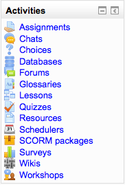

.. _activities_block:

Activities
===========
An activity is generally an interactive learning segment for a student in a course. The teacher adds activities by a pull down menu found in their course's sections when the edit mode is turned on. 

The Activities block lists and allows navigation between the different activities available in your course (Forums, Quizzes, Assignments, Lesson module and so forth). The activities list will grow as you add activities to your course. Therefore, the first time you enter your course, the only category that is listed is Forums. This is because one forum exists by default – the news forum.

Whenever you add a different activity or resource to your course, an icon will appear in this block representing the specific Moodle module. These icons will link to a list of all instances of that module's activity that appear throughout the course. 

