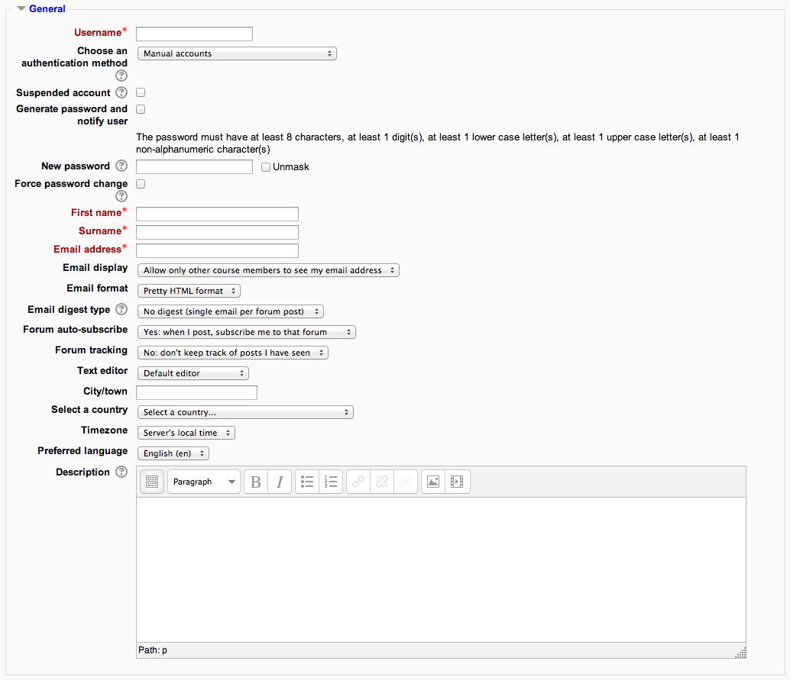

.. _add_a_new_user:

Add a new user
===============

An administrator or manager can create new user accounts in Administration > Site administration > Users > Accounts > Add a new user.

General
^^^^^^^^

**Username -** The user will use this username to log into the Moodle. It should be unique.

**Authentication method -** Accounts created by an administrator use the Manual Accounts method, and accounts created by the user themselves using the email sign-up method use the E-mail based self-registration method.

**Suspended account -** Suspended user accounts cannot log in or use web services, and any outgoing messages are discarded.

**Generate password and notify user -** Moodle will generate a temporary password and email the user with instructions on how to log in and change it. The email message (as in the screenshot below)may be changed in Site administration > Administration > Language > Language settings. Select 'moodle.php' and the string identifier newusernewpasswordtext

**Password -** This is the user's password.

**First Name -** The user's first name.

**Surname -** The user's surname.

**Email address -** Password reset notices, forum digests and other messages are sent to this email address from the Moodle site.

**Email display -** This setting controls who can see the user's email address.

**Email format -** This setting can be used such that Moodle will send text-only emails to the users.

**Email digest type -** This setting set whether the user will receive an email for each new forum post in subscribed forums, or if new posts should be sent once per day in a digest, and which type of digest.

        No digest (one receives individual emails),
        Complete (a single digest daily) or
        Subjects (a single digest daily with only the post topics included).

**Forum auto-subscribe -** If a user subscribes to a forum, new posts will be sent in the digest as specified. This setting sets whether a user is automatically subscribed to forums or if a manual click on the subscription button in each forum is required.

**Forum tracking -** This setting specifies whether new posts written since the user's last visit should be highlighted a such.

**When editing text -** This setting specifies whether the user prefers to see the WYSIWYG text editor or just a plain text box.

**City / town -** The user's city or town.

**Country -** The user's country.

**Timezone -** This setting is used to adjust the times of messages and assignment/quiz due dates to match the user's local time.

**Preferred language -** This will cause the Moodle interface to be displayed in the specified language.
**Note:** Content will not be translated automatically, but if multi-language content is entered the appropriate language content will be displayed, if available.

**Description -** Information about the user that other users can see.

User Picture
^^^^^^^^^^^^^

The user's picture can be displayed next to the user's name, to any content he/she has posted in Moodle activities such as forum.

Additional names
^^^^^^^^^^^^^^^^^

Here you can fill additional names if you required.

Interests
^^^^^^^^^^

The list of interests can be used as a way of connecting users with similar interests. Tags must be enabled on the site.

Optional
^^^^^^^^^

These include: Web Page, ICA number, Skype ID, AIM ID, Yahoo ID, MSN ID, ID number, Institution, Department, Phone, Mobile Phone, Address.
