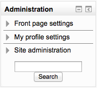
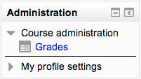
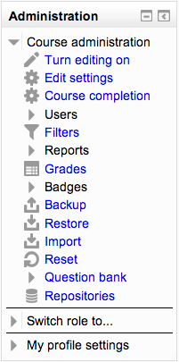

.. _administration_block:

Administration block
=====================
The Administration block provides context-sensitive links to settings pages.

What appears in the Administration block depends upon the Context (Page being shown and user's permissions). For example, a site administrator on the front page will have Front page settings while a teacher in a course will have more options in Course administration than a student.

Here are examples of the Administration block: 

Admin view from front page

Student view in a course

Teacher view in a course

