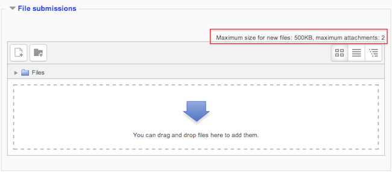

.. _assignment:

Assignment
===========
The assignment module allows teachers to collect work from students, review it and provide feedback including grades. The work a student submits is visible only to the teacher and not to other students. 

Students can submit any digital content (files), including, for example, word-processed documents, spreadsheets, images, audio and video clips. Assignments don't necessarily have to consist of file uploads. Alternatively, teachers can ask students to type directly into Moodle using an online text assignment. There is also an offline activity assignment which can be used to remind students of 'real-world' assignments they need to complete and to record grades in Moodle for activities that don't have an online component.

Assignment Types
------------------
There are 4 types of assignments:

Upload a single file
^^^^^^^^^^^^^^^^^^^^^
A student can upload a single file, such as a Word document, spreadsheet or anything digital. Multiple files can be zipped and then submitted. After learners upload their files in this arrangement, the instructor will be able to open the submission and then use the Moodle interface to assign a grade and offer comments as feedback. 

Advanced uploading of files
^^^^^^^^^^^^^^^^^^^^^^^^^^^^
Options include multiple file submission, allowing students to type a message alongside their submission & returning a file as feedback. 

Online Text
^^^^^^^^^^^^^
This assignment type asks users to compose and edit text, using the normal editing tools. The online text assignment can be set up to allow learners to compose, revise and edit over time or such that the learner only has one opportunity to enter his or her response. Furthermore, with the online assignment, instructors can grade the work online and even edit and/or provide comments within the learner’s work. The online text assignment is ideal for journalling and composition work. 

Offline activity
^^^^^^^^^^^^^^^^^
This is useful when the assignment is performed outside of Moodle. It could be something elsewhere on the web or face-to-face. Students can see a description of the assignment, but can't upload files. Grading works normally, and students will get notification of their grades. 

Specifically, an instructor in a hybrid or blended environment (combination of face-to-face and online instruction) may use the offline activity type of assignment to assign a project that the learner will physically present to the instructor at a face-to-face session. This arrangement allows the instructor to communicate the project expectations online while creating an entry for the project in the Moodle gradebook. 

In another example, consider the instructor who gives reading assignments or assigns problems for practice. These activities wouldn’t necessarily be turned in for a grade, but the instructor needs a tool for communicating the assignment details. The offline assignment, with its unique icon, could be used as a consistent visual cue for the learners; learners would come to know that they can always look for the assignment icon to see what work they need to complete. 

Adding and editing an Assignment activity
-------------------------------------------

  * To add a new Assignment activity to your course, login with the appropriate access rights (e.g.editing teacher, course creator or administrator) and Turn Editing On. Within the required Week or Topic Block click Add and Activity or Resource link.
  * In the Add an activity or resource dialogue box that appears, select Assignment and click Add.
  * To edit an existing Assignment activity, login to your course with the appropriate access rights (e.g. editing teacher, course creator or administrator) and Turn Editing On. Select the Update icon against the relevant Assignment item.
  * Alternatively, after logging into your course simply click on the name of the Assignment activity you wish to edit and then click the Edit Settings link under Assignment administration within the Settings block. 

The following configuration options are available when creating or editing/updating any Assignment activity. Only General,Availability and Submission types are open by default;the others are collapsed. To expand everything, click the "Expand all" link top right. Click on any screenshot to see it full size. 

General
^^^^^^^^
The General section allows you to give your assignment a name and description. 

**Assignment name**

Give your Assignment a name (e.g. “Report on Topic 1 Content”). The title entered here will be the name that learners see in the course content area. Learners will click on this name to view the details of the assignment and, if applicable, submit their work. 

**Description**

The description of the assignment, which should include precise instructions for students regarding the subject of the assignment, the form, in which it should be submitted, the grading criteria etc.

Use this area to describe the assignment and explain what learners are expected to do to complete this task. The assignment description can be as brief or as detailed as you feel is necessary to meet the needs of your learners. However, it is to your benefit to provide as much detail and information as possible, especially at the start of the course while you are still establishing procedures. Generally, the more information you are able to provide here the fewer questions and problems your learners will have completing the task.

The assignment description field can also be used to provide information or resources related to the assignment. An instructor, for example, could provide some literature, a video clip, an image, or a link to a webpage, and then ask the learners to use these materials in completing the task. 

**Display description on course page**

Enabling this will display the description on the course page just below the link to the assignment activity. 

Availability
^^^^^^^^^^^^^

**Allow submissions from**

The Allow submissions from setting prevents students from submitting their assignment before the shown date. A teacher can to set a day, month, year and time (24 hour clock) from which learners can begin to submit their assignments. Please note that this setting does not hide the activity from the learners. Instead, the learner will see the activity, be able to view the instructions and use any materials you have included in the description, but the learner will not be able to submit or complete the assignment until the Allow submissions from date.

This setting is enabled (ticked/checked) by default and is set at the day and time you added the assignment. To disable this, remove the tick/check. 

**Due date**

The Due date setting establishes when the assignment is due. Submissions will still be allowed after this date, but any assignments submitted after this date are marked as late.

This option allows an teacher to set a day, month, year and time (24 hour clock) before which learners must submit their assignment.

By default the Due date is Enabled (ticked) and is set at 7 days ahead of the day and time you selected Add Assignment. To disable this feature, simply ensure the Enable checkbox is not marked. For more information on using the Due Date see Assignment FAQ

Note: Assignments without a Due date will appear on the My home page with “No Due date” displayed. 

**Cut-off date**

The Cut-off date is the date beyond which students will not be able to send in their assignment as the button for doing so will no longer be displayed. After that date (or time) a teacher may, on request, grant an extension by going to the class assignment grading screen, clicking the "Edit" column and choosing "grant extension" for the relevant student. 

**Always show description**

This setting is used in conjunction with the Allow submissions from setting. If it is set to Yes, the assignment Description will become visible to students at the Allow submissions from date. If it is set to No, the assignment Description will be hidden from students until the Allow submissions from date, only the assignment Name will be displayed

Submission Types
^^^^^^^^^^^^^^^^^^
Here you can decide how you wish students to submit their work to you.

*Note that if Submission comments are enabled in Administration > Plugins > Activity modules > Assignment > Submission plugins then students will be able to add a note to their teacher on submitting work. If Blind marking is enabled, student comments display as from "Participant 01 etc" to avoid revealing identities. These comments will appear in the grading table in the Submission comments column.*

**Online text**

Learners can type their response directly in Moodle using the text editor. 

**File submissions**

Learners can upload and edit one or more files of any type the teacher can open.

If the student uploads a pdf file, the teacher can annotate it within the browser, and on saving, the annotated file is made available to the student. See section 5.3.1 Annotating pdfs in Using Assignment

Note: This requires Ghostscript to be enabled on the server. This can be checked in Administration > Site administration > Plugins > Activity modules > Assignments > Feedback plugins > Annotate pdf. 

**Maximum number of uploaded files**

Here you can decide the maximum number of files which may be uploaded by each learner. (It might be helpful to display the number in the assignment description.) 

**Maximum submission size**

This setting specifies the maximum size per file of each of the files that the students can upload as part of their submission. This maximum upload size may only be equal to or less than the course limit (which in turn may only be equal to or less than the site limit). The maximum size of each file is displayed to students at the point where they upload files. 

Feedback Types
^^^^^^^^^^^^^^^
(This setting is collapsed by default) 

**Feedback comments**
Setting this to yes means that markers can leave feedback comments for each submission. It enables the Feedback Comments column in the grading table.(To access the grading table, click on the assignment activity and then View/Grade all Submissions). Feedback comments are also accessible by clicking on the green tick in the grade column on the grading table. 

**Offline grading worksheet**
If set to yes, the teacher will have a link to download the grading list as a spreadsheet. They will then be able to enter grades and feedback comments offline.

When the teacher has completed their grading offline, they can then upload the spreadsheet, confirm the changes and the grades and comments will be transferred over into Moodle's gradebook

**Feedback files**

This allows markers to upload files with feedback when marking. These files may be the marked up student assignments, documents with comments, a completed marking guide, or spoken audio feedback. It enables the Feedback Files column in the grading table. (To access the grading table click on the assignment activity and then View/Grade all Submissions)To upload feedback files, click on the green tick in the grade column on the grading table and then upload either with drag and drop or using the File picker.

Feedback is displayed to students on the assignment submission page. 

Uploading multiple feedback files - It is also possible to upload multiple feedback files as a zip, from the dropdown above the grading list:

   1. Download the students' assignments using the "Download all submissions" link from the same dropdown menu;
   2. Extract the folder offline and add your comments to the student's submissions.Keep the names the same.
   3. Select the students' submissions and zip them into a new folder. Important: Don't just edit them inside their original folder and re-zip this; it will not work. The folder name does not matter as long as the feedback files have the same names as before.
   4. Upload this newly zipped folder.
   5. You will be presented with a confirmation screen displaying your feedback files. 

**Note:** If you zip files on a Mac, you may get a folder included in the zip called _MACOSX_ which needs to be removed otherwise moodle will not recognise the changes in the files. 

Submission settings
^^^^^^^^^^^^^^^^^^^^
(This setting is collapsed by default) 

**Require students click submit button**

Students can upload draft versions of the assignment until such time as they are ready to submit.Once they click the submit button they indicate to the teacher that they have finished working on the assignment. In earlier versions of Moodle this was called *"Send for marking"* .)

They can then longer edit their submission. If they need to change it, they must ask the teacher who can revert the assignment to draft status.

To revert to the draft stage, click on the assignment activity and then View/Grade all Submissions. Locate the student and click the action icon in the Edit column. Select Revert the submission to draft.

If this setting is No, then students do not have to to click a submit button and are able to make changes to uploaded files at any time.

If this setting is No but the teacher wishes to grade students work, then you can stop students from making further changes by using Prevent submission changes. Prevent submission changes can also be used in cases where students have neglected to click the Submit button and grading has commenced. To prevent submission changes, click on the assignment activity, then click on the View/Grade all submissions button. On the grading table, locate the student and click the action icon in the Edit column. Select Prevent submission changes.

To do either of these with a number of students, use the With selected menu at the bottom of the grading table

To do either of these with a number of students, use the With selected menu at the bottom of the grading table. 

**Require that students accept the submission statement**
An administrator can define a "Submission statement", ie, a statement where students promise the work is their own and which they must agree to before submitting their work. This may be done via *Settings > Site administration > Plugins > Activity modules > Assignment*.

If preferred, the available default statement which may be used instead: *This assignment is my own work, except where I have acknowledged the use of the works of other people*

When this setting is enabled, students will have to check a button before they can submit their assignment:

If the administrator has forced the statement throughout the site, a teacher will not have this option in the settings but a student will see the statement when accessing their assignment. 

**Attempts reopened**

This setting allows the teacher to decide how submissions are reopened. The default is "Never", in that students may only submit once. However, a teacher can set this to "Manually" and reopen it themselves for the student to resubmit, or to "Automatically until pass". The student must then keep trying and resubmitting until they get a pass grade. Passing grades are set in the Gradebook. 

**Maximum attempts**

If a student is allowed to resubmit, this setting will determine how many times they can resubmit before they are no longer allowed to do so. (For example, if a student has to keep trying until they get a pass grade, the teacher might decide that ten attempts is enough even though they have not yet passed!) 

Groups submission settings
^^^^^^^^^^^^^^^^^^^^^^^^^^^
(This setting is collapsed by default) 

**Students submit in groups**

If this box is ticked, then students are able to collaborate on an assignment. This might involve for example, working in the same online text area, or one student uploading an MS Powerpoint which another student downloads, improves and re-uploads to the common assignment area.

When grading, the teacher may choose to give a common grade and feedback to all students in the group or to give individual grades and feedback to each member.

If no groups have been made, then Moodle will make a default group of every student in the course. 

**Require all group members submit**

This setting will only appear if the teacher has ticked the "Require students click submit button" earlier. The assignment will not be classed as "submitted" until all members of the group have made a contribution. When one student has submitted, the other members of the group will be able to see who still has to submit.

**Grouping for student groups**

If a particular grouping is selected here, then the gradebook will display any other groups and non-grouped students in the "default group", while naming the group(s) that are in the chosen grouping. If "none" is selected, then the gradebook will display the names of all groups and put any non-grouped students in the "default group".

Notifications
^^^^^^^^^^^^^^
(This setting is collapsed by default) 

**Notify graders about submissions**

Teachers will receive a message (of a type they choose) whenever a student submits an assignment. Please note if you are using the assignment in Groups Mode (eg Separate or Visible Groups), the teacher will need to be a member of the group in order to receive the submission notification.

**Notify graders about late submission**

Teachers will receive a message (of a type they choose)whenever a student submits a late assignment. Please note if you are using the assignment in Groups Mode (eg Separate or Visible Groups), the teacher will need to be a member of the group in order to receive the submission notification. 

Grade
^^^^^^
(This setting is collapsed by default)

**Grade**

Specify the maximum grade or Scale to be applied to the assignment. If you will not be giving a grade for the assignment, choose No Grade.

**Grading method**

There are 3 options:

  * Simple direct grading (entering a grade or scale item)
  * :ref:`Marking guide <marking_guide>`
  * :ref:`Rubric <rubric>` 

**Grade Category**

Any custom Grade Categories that have been created within your site or course will be listed here and will be available for selection. Select the required Grade Category to add this assignment as a Grade item within this Category. 

**Blind marking**

If this setting is enabled, then a teacher will not see the names of students who have submitted their assignments. Instead, they will see randomly generated Participant numbers. (The student view of the assignment does not change.) This is also the case if student comments have been enabled. Once they have graded the assignment, it is however possible for teachers to see who submitted what by clicking on "Reveal student identities" in the Assignment settings.

Returning Marks to Students - Because of the nature of blind marking, the students cannot see the final grade until all of the students names have been revealed. This is found in Assignment Settings > Reveal Student Names. However, feedback comments will appear. 

**Use marking workflow**

When set to Yes, teachers will be able to specify the stage they are at in their grading of individual assignments.

Marking workflow state in the individual grading screen

Dropdown to select marking workflow state when quick grading

One advantage of using marking workflow is that the grades can be hidden from students until they are set to 'Released'. The actual list of steps are:

  * Not marked (the marker has not yet started)
  * In marking (the marker has started but not yet finished)
  * Marking completed (the marker has finished but might need to go back for checking/corrections)
  * In review (the marking is now with the teacher in charge for quality checking)
  * Ready for release (the teacher in charge is satisfied with the marking but wait before giving students access to the marking)
  * Released (the student can access the grades/feedback) 

Example use cases

One marker, Marker, wants to release all grades at the same time

  * Marker enables "Use marking workflow"
  * Marker marks each submission and transitions the grading to "Marking completed" as each submission is graded.
  * Marker then uses the batch operations to transition all grades to "Released" at the same time. 

Multiple markers,

  * Marker enables "Use marking workflow"
  * Marker marks each submission and transitions the grading to "Marking completed" as each submission is graded.
  * Marker then uses the batch operations to transition all grades to "Released" at the same time. 

**Use marking allocation**

If marking workflow (see above) is set to Yes, it is possible to enable marking allocation. This means that teachers can be selected to grade or review the submitted work of specific students. Colleagues can monitor progress through the displayed marking workflow states.

Allocated markers on the grading screen

Common module settings
^^^^^^^^^^^^^^^^^^^^^^^
See :ref:`Common module settings <common_module_settings>`

Restrict access settings
^^^^^^^^^^^^^^^^^^^^^^^^^^
The :ref:`Restrict access <restrict_access_settings>` area becomes visible in Moodle activities and resource settings if :ref:`Conditional Activities <conditional_activities_settings> have been enabled. 

Locally assigned roles
^^^^^^^^^^^^^^^^^^^^^^^
In *Administration > Assignment administration > Locally assigned roles* selected users can be given additional roles in the activity.

Assignment capabilities
^^^^^^^^^^^^^^^^^^^^^^^^
  
  * Export own submission
  * Grade assignment
  * Submit assignment
  * view assignment
  
Role permissions for the activity can be changed in *Administration > Assignment administration > Permissions*.

