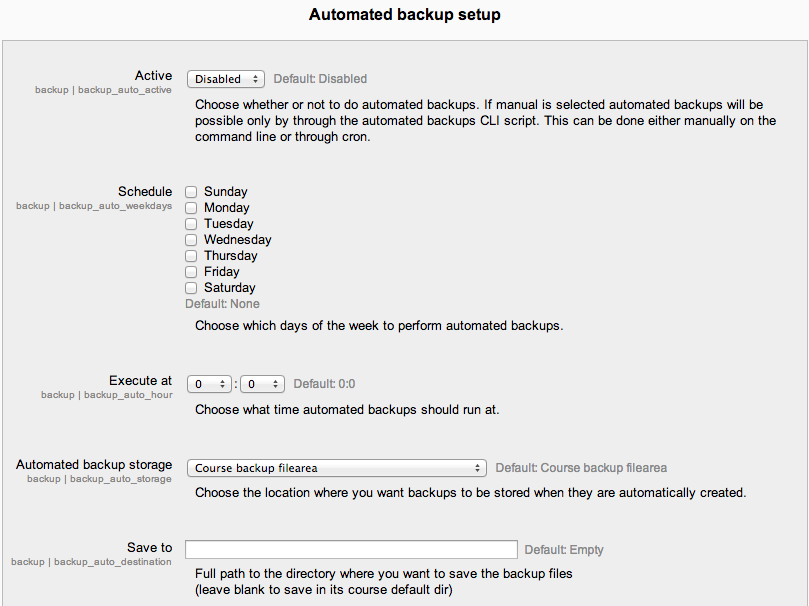

.. _automated_backup_setup:

Automated Course Backup
========================
A site administrator can configure a schedule for automated course backups in *Settings > Site administration > > Courses > Backups > Automated backup setup*.

Moodle has an automated course backup system that you can run on a nightly basis to export all course content for the entire site. Automated course backups runs the same functions as individual course backups. It's a good idea to schedule backups for when your server isn't usually busy. Running the backup tool over all the courses can be processor-intensive, so you shouldn't run it when there are a lot of students trying to access the server. You should always alert users with an announcement on the first page that if they log on during the backup hours they may notice a decrease in performance. 

In order to make scheduled backups, you have to set up CRON to run periodically. Please refer to the :ref:`cron instructions <cron>` .

Setting an automated course backup schedule
--------------------------------------------
To set the backup schedule:

    1. Go to *Settings > Site administration > > Courses > Backups > Automated backup setup*.
    2. Set backup_auto_active to enabled.
    3. Select the days of the week to run the backup.
    4. Set the execution time for the backup process. For most servers, early morning will be the best time. Keep in mind the time zone your server is using.
    5. Set the "Save to..." path. If you can, choose a backup path on another machine or on a different drive than the one Moodle is on. You don’t want to lose your backups at the same time you lose your Moodle site if the drive fails. If you leave the field blank, then backup zip files will be saved in the backup folder of each course files folder. On a Linux server the path might look like: /home/(your user or domain)/public_html/archive/ or if it's below the publicly accessible folders: /home/(your user or domain)/archive/ if the path is not recognized a red X is shown after saving, otherwise a green check.
    6. Choose whether to skip the backup of hidden courses or courses which have not been modified within a specified number of days, or not modified since the last backup (new settings in Moodle 2.4 onwards).
    7. Click the "Save changes" button. 

Once you've set up your backup schedule, Moodle will automatically create archives of all the courses on the server at the time you specified. Once the backup is complete, Moodle will send you an email describing the status of the backup. 

Use course names for your backups
^^^^^^^^^^^^^^^^^^^^^^^^^^^^^^^^^^
By default, the backups will be named according to the course ID, which is not always easily recognisable. Check the box Use course name in backup filename in *Settings > Site Administration > Courses > Backups > Automated backup setup* to have them saved with the course shortname instead. 
