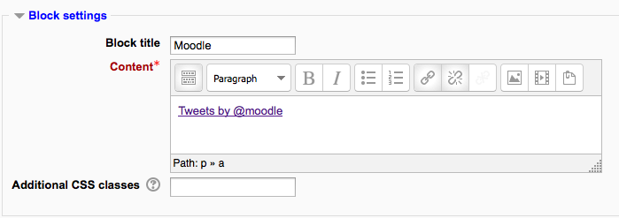

.. _block_settings:

Block Settings
===============

Adding a block to a page
--------------------------
Blocks can be added to a page by turning editing on then using the 'Add a block' drop-down menu.

Note: The ability to add a particular block to a page is controlled by an *addinstance capability* (e.g. block/comments:addinstance), which is allowed for the default role of teacher. 

Block configuration
---------------------
After adding a block, click the edit icon in the block header to configure it. 

Block settings
^^^^^^^^^^^^^^^^
Certain blocks, such as the HTML block, allow a block title and more to be set. 

Where this block appears
^^^^^^^^^^^^^^^^^^^^^^^^^
Depending upon the context and users permissions, this area determines where this block will appear.

 * Original block location: provides information about where the block was initially created.
 * Display on page types: allows the user to set the context that the block can appear in. These options will vary depending upon the permissions of the user. For example a site administrator might see a setting that will allow the block to appear on Any page, or any type of course main page, while a teacher may only see the option to place it on every page in the course.
 * Default region: Usually a right column or left column option.
 * Default weight: Where in the column do you want it to appear if there are other blocks in that column. -10 will put it at the top, 10 will put it at the bottom. A zero is neutral. 

 .. image:: _images/block_settings2.png
 
See :ref:`User profiles <user_profiles>` for instructions on how to make a block appear on all user profile pages. 

On this page
^^^^^^^^^^^^^
 * Visible - Yes or No.
 * Region - Here you can override the column preference on this page.
 * Weight - Here you can override the default setting on this page. 
 
  .. image:: _images/block_settings3.png
 
'Sticky blocks'
-----------------
The term 'sticky' block was used in older versions of Moodle to mean blocks which the admin added either site-wide or to the :ref:`My home <my_home>` page and which could not be deleted by regular users. Although the term is no longer used, it is still possible to make blocks 'sticky' and in a wider variety of locations.

If an admin deletes a "sticky" block in a course, they receive a warning of the site-wide consequences of this action before it is deleted.

Here are a few examples:

Making a block sticky throughout the whole site
^^^^^^^^^^^^^^^^^^^^^^^^^^^^^^^^^^^^^^^^^^^^^^^^^
The Moodle administrator might wish for example to display support contact details sitewide using an HTML block called 'Helpdesk':

 * As an administrator, turn on the editing on the front page and add the block you wish to make sticky.
 * For Where this block appears > Page contexts, choose 'Display throughout the entire site'.
 * Decide other settings according to your preference and save.
 * The block will now appear on all pages of your Moodle. 
 
 .. image:: _images/block_settings4.png

Making a block sticky throughout a course
^^^^^^^^^^^^^^^^^^^^^^^^^^^^^^^^^^^^^^^^^^^
The teacher might wish for example to display the Messages block everywhere in the course. This would allow students easily to message each other and their tutors not only on the course from the main page but also on individual activities. The block would be available on admin pages too.

 * As a teacher in the course, turn on the editing on the course main page and add the block you wish to make sticky.
 * For *Display on page types*, choose 'Any page'
 * Decide other settings according to your preferences and save.
 * The block will now appear on all pages of the course. 

 .. image:: _images/block_settings5.png

Making a block sticky in a category
^^^^^^^^^^^^^^^^^^^^^^^^^^^^^^^^^^^^^
A user with category rights might for instance wish to display a Remote RSS feeds block in all of the courses within a particular category, such as a Head of Science adding Science news feeds to the Physics, Biology and Chemistry courses. While this should be possible, there are currently problems with blocks on category pages not saving the required page context.

Making a block sticky in a resource or an activity
^^^^^^^^^^^^^^^^^^^^^^^^^^^^^^^^^^^^^^^^^^^^^^^^^^^^
A teacher might wish to display a block in one particular resource or activity, for example a Head of Faculty might make create a Book for departmental policies and wish to add the comments block to every chapter/page of a book so colleagues can give quick feedback. (Note that such a comments block would be the same block on each chapter/page)

 1. As a teacher in the course, turn on the editing and click into the resource/activity -in this case a Book and add the block.
 2. For *Display on page types*, you will see (for example) 'mod-book*'
 3. Decide other settings according to your preferences and save.
 4. The block will now appear on all related screens. 

Adding a block to all user profile pages
^^^^^^^^^^^^^^^^^^^^^^^^^^^^^^^^^^^^^^^^^^
See :ref:`User profiles <user_profiles>`

Adding a block to My home page for all users
^^^^^^^^^^^^^^^^^^^^^^^^^^^^^^^^^^^^^^^^^^^^^^
See :ref:`My home <my_home>` Note that such a block would not be truly 'sticky', in that users can customise their My home page and could, if wished, delete the block. 

Block permissions
-------------------
To change role permissions for a block

 1. Turn editing on in the course
 2. Click the Assign roles icon (a face and mask) in the header of the block
 3. In the administration block, go to *Block administration > Permissions* (ignore the message 'You are not able to assign any roles here', which is to be expected, since roles are not generally assigned in the block context) 
 
 .. image:: _images/block_settings6.png

