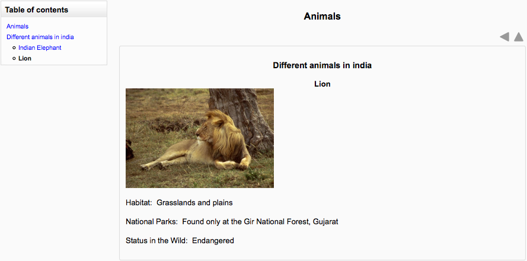
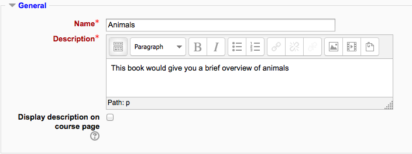
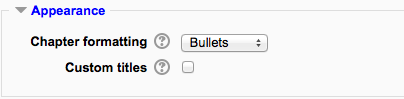
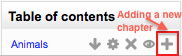
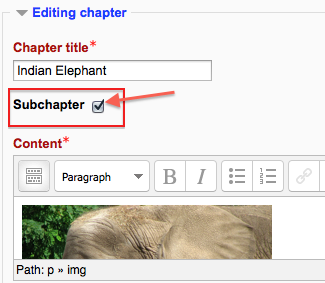
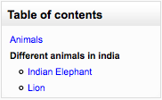

.. _book:

Book
=====

The Book module makes it easy to create multi-page resources with a book-like format. 

Previously created websites can be imported directly into the Book module. Books can be printed entirely or by chapter.

The book module allows you to have main chapters and sub chapters, but it goes no deeper. In other words, sub chapters cannot have their own sub chapters, as the module is intended to be a simple resource for teachers and students.

The book module is not interactive. You can, however, link to choices, forums etc., from within a book. Also, Flash movies and other multimedia may be included in a book 

Adding a book
---------------
A teacher can add a book by choosing it from the "Add an activity or resource" link (or, if not present, the "Add a resource" drop down menu in course.) All settings may expanded by clicking the "Expand all" link top right. 

General
^^^^^^^^

**Name**

Use a descriptive name for your book as it will form the link the students will click on to access it.

**Description**

Provide information for your students here so they are clear what the book is about. Click "Show editing tools" to display the rich text editor and drag the bottom right of the text box out to expand it.

**Display description on course page**

Enabling this will display the description on the course page just below the link to the book. 

Appearance
^^^^^^^^^^^^
(These settings are collapsed by default.) 

**Chapter formatting**

The options are:

  * None - chapter and subchapter titles are not formatted at all, use if you want to define special numbering styles. For example letters: in chapter title type "A First Chapter", "A.1 Some Subchapter",... 

  * Numbers - chapters and subchapters are numbered (1, 1.1, 1.2, 2, ...) 

  * Bullets - subchapters are indented and displayed with bullets. 

  * Indented - subchapters are indented. 

**Custom titles**

If you disallow custom titles, the chapter title (the one that appears on the table of contents) will appear as a header at the top of your content. If you enable custom titles, you will be able to create a title different from the one that appears in the ToC or display no title at all. If you enable custom titles, you will need to enter the chapter title as part of the page content. 

Common module settings
^^^^^^^^^^^^^^^^^^^^^^^
(These settings are collapsed by default.)

See :ref:`Common module settings <common_module_settings>`

Restrict access/Activity completion
^^^^^^^^^^^^^^^^^^^^^^^^^^^^^^^^^^^^^
(These settings are collapsed by default)

These settings are visible if :ref:`Conditional activities <conditional_activities_settings>` and :ref:`Activity completion <activity_completion_settings>` have been enabled in the site and the course.

Adding chapters and subchapters
---------------------------------
Titles of chapters appear as links in the table of contents to the left of your content. Keep your titles short.

To add another chapter, click on the red cross in the Table of Contents or first chapter. The new chapter will be inserted directly after the chapter whose title is on the same line as the red cross you click (Screenshot 1).

Note that the sub chapter box is checked. A chapter may have many sub chapters, but sub chapters cannot have subchapters. In order to keep this resource simple, you are limited to two levels (Screenshot 2).

You now see a chapter and a sub chapter. Because we did not elect to number chapters, the fact that the second chapter is a sub chapter cannot be seen in the table of contents. Note that you do, however, see this in the title above the content.

By the way, the items in the table of contents are neither numbered nor are they indented only because that is the option we chose when setting up the book. We can always go back and change that (Screenshot 3). 

Adding a new chapter

Adding a subchapter

View of subchapter

Importing chapters
--------------------
To import chapters

  * Create a zip file of HTML files and optional multimedia files and folders. If you wish to upload subchapters, add "_sub" to the end of HTML file or folder names.
  * Go to *Administration > Book administration > Import chapter*.
  * Choose whether each HTML file or folder represents one chapter.
  * Browse for and select the zip file, either using the Add button or the drag and drop method.
  * Click the import button.
  
  .. image:: _images/book_8.png
  Import book

**Note:** Relative file links are converted to absolute chapter links. Images, Flash and Java are re-linked too. Remember to upload images and multimedia files as well as HTML files. 

Book capabilities
------------------
  * Edit book chapters
  * Read book
  * View hidden book chapters
  * Export book as IMS content package
  * Import chapters
  * Print book
  * Add a new book 

