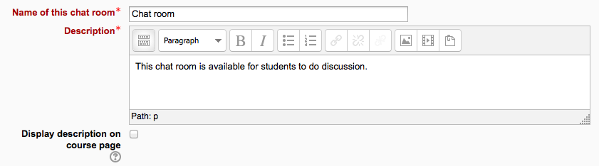
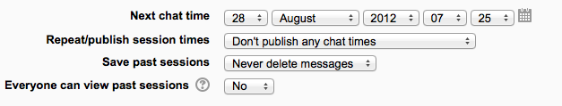
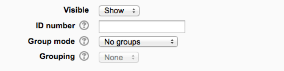

.. _chat:

Chat
=====
The chat activity module allows participants to have a real-time synchronous discussion in a Moodle course. 

This is a useful way to get a different understanding of each other and the topic being discussed – the mode of using a chat room is quite different from the asynchronous forums. The Chat module contains a number of features for managing and reviewing chat discussions. 

Addinga a Chat to your course
-------------------------------
With the editing turned on,in the section you wish to add your chat, click the "Add an activity or resource" link (or, if not present, the "Add an activity" drop down menu )and choose Chat All settings may expanded by clicking the "Expand all" link top right. 

General
^^^^^^^^

**Name of this chat room**

Whatever you type here will form the link learners click on to enter the chat so it is helpful to give it a name that suggests its purpose - for example "Student council discussion" or "Field trip planning meeting". 

**Description**

Type the description of the chat here. Include precise instructions for students regarding the subject of the chat. Click the icon on the left to expand the toolbar, and drag the bottom right of the text box out to expand it. 

**Display description on course page**

If this box is ticked, the description will appear on the course page just below the name of the Chat. 

Chat sessions
^^^^^^^^^^^^^^
(These settings are collapsed by default.) 

**Next chat time**

  * The day and hour of the next chat session. This will appear in the calendar so students know the schedule but it doesn't stop them accessing the chatroom at any other time.
  * If you don't want them in the chatroom at other times, then hide it (with the eye icon) or use Conditional activities to restrict access.
  * If you don't wish to schedule chat times then ignore this and choose from the next settings. 

**Note:** For courses involving users across different time zones, it is useful to know that the time you set here will be adjusted to match the time zone of the user viewing it. 

**Repeat/publish sessions**

There are four options for scheduling future chat sessions: 

  1. **Don't publish any chat times** - there are no set times and students are welcome to chat at any time.
  2. **No repeats - publish the specified time only** - only the Next chat time will be published. This could be used to schedule special events or meetings or simply to help learners identify a common time in which they can expect to find other learners in the chat room.
  3. **At the same time every day** - Daily chats are useful for scheduling daily office hours or work sessions with learners.
  4. **At the same time every week** - This setting will schedule a chat for the same day and time every week, which could be useful for instance for meeting and reviewing key ideas and questions related to the week’s content/assessment. 

**Save past chat sessions**

  * Choose from the dropdown how many days to save - or save everything by selecting *Never delete messages*
  * If you have any concerns about discussions that might take place in your chat room, you may want to keep transcripts to check the suitablility of what is discussed. If your learners are using the chatroom to collaborate on a group project you won't want to delete the messages until the project is complete. 

**Everyone can view past sessions**

  * Decide here whether or not allow everyone to view past chat sessions. (Teachers can always view past sessions) 

Common module settings
^^^^^^^^^^^^^^^^^^^^^^^
(These settings are collapsed by default.)

See :ref:`Common module settings <common_module_settings>`

Restrict access/Activity completion
^^^^^^^^^^^^^^^^^^^^^^^^^^^^^^^^^^^^^
(These settings are collapsed by default)

These settings are visible if :ref:`Conditional activities <conditional_activities_settings>` and :ref:`Activity completion <activity_completion_settings>` have been enabled in the site and the course.

Locally assigned roles
^^^^^^^^^^^^^^^^^^^^^^^
  * In *Administration > Chat administration > Locally assigned roles* selected users can be given additional roles in the activity, such as the capability to delete chat logs. 
  * Role permissions for the activity can be changed in *Administration > Chat administration > Permissions*.

