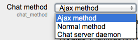

.. _chat_settings:

Chat
=====
The chat module has additional settings which may be changed by an administrator in *Administration > Site administration > Plugins > Activity modules > Chat*. They depend on the chat method which has been selected.

Chat method  
^^^^^^^^^^^^^
You can select the any default chat method.

Ajax 
^^^^^
This is the default method. It works everywhere but if many people are chatting it can put a large load on the server. Its particular settings are:

    * Refresh user list - choose the number of seconds after which the user list is refreshed
    * Disconnect timeout - choose the number of seconds after which we detect a user has disconnected. 

Normal method
^^^^^^^^^^^^^^
The particular settings for this method are:

    * Refresh room - choose the number of seconds after which the room is refreshed
    * Update method - choose how to update the chatroom - "Keep alive" or "Stream" strategy. Stream works better but your sever might not support it. 

Chat server daemon
^^^^^^^^^^^^^^^^^^^
A daemon is a program that runs all the time in the background. In this case it's a PHP script, listening to a particular port on your server, accepting and giving out chat information.If you intend to use the chat activity a lot, then you should consider using a chat server daemon to reduce server load.Its particular settings are:
    
    * Server name
    * Server IP address
    * Server port
    * Max users 

Then you need to start the chat daemon script from the command line: 

.. line-block:: 

   cd moodle/mod/chat
   php chatd.php --start &
   
   
   
   
