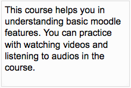

.. _courses_block:

Course / site summary block
=============================
The course/site summary block provides a summary and/or description for your course as contained in the summary text of the course settings. 

Note: The front page summary, accessed from *Administration > Front page Settings > Edit settings*, can appear as a side block similar to the course summary blocks. Alternatively, if you want your front page summary in the centre of the front page, check "include a topic section" in the Edit settings page. 
