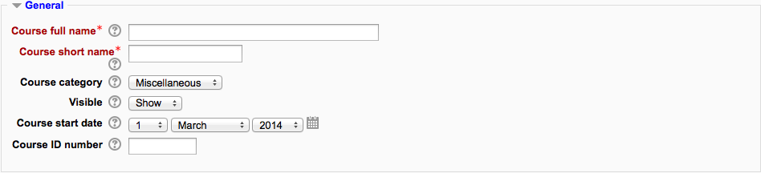
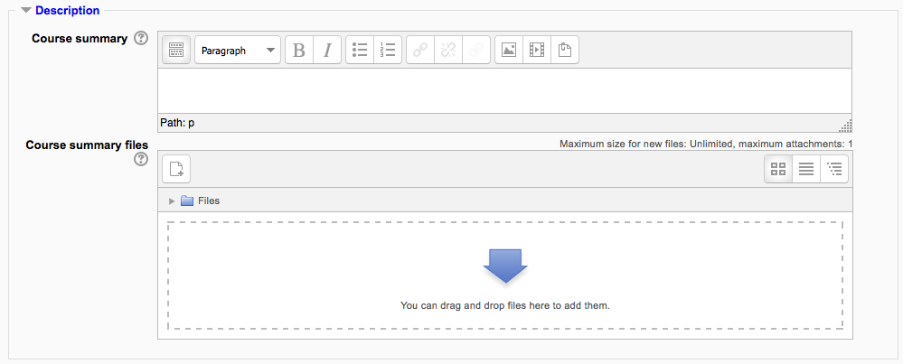
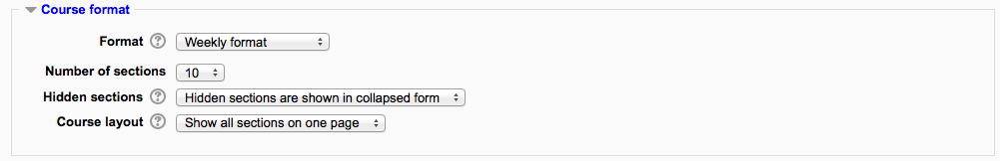
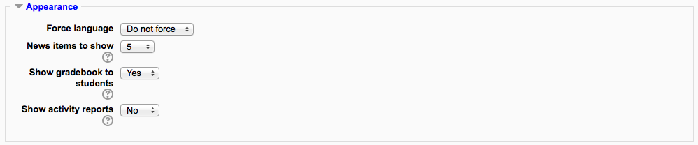
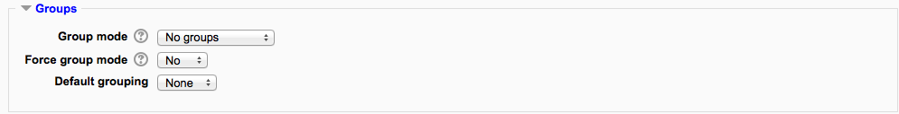

.. _course_settings:

Course Settings
================
A teacher, or other user with the update course settings capability, can change course settings in *Administration > Course administration > Edit settings*. 

General
--------

Course full name
^^^^^^^^^^^^^^^^^^
This is the name of the course. It is displayed as a link on course lists on the Front page and on My home and in reports. It is also used in the browser title bar when the course is viewed.

The capability moodle/course:changefullname controls whether a user can edit the course full name. 

Short name
^^^^^^^^^^^
Many institutions have a shorthand way of referring to a course, such as BP102 or COMMS. Even if you do not already have such a name for your course, make one up here. It will be used in several places where the long name is not appropriate, such as the Navigation block.

The capability moodle/course:changeshortname controls whether a user can edit the short name field.

By default, only course full names are displayed in the list of courses. However an administrator can enable short names to be displayed too if required by ticking the checkbox in *Administration > Site administration > Appearance > Courses*.

Course category
^^^^^^^^^^^^^^^^
The site administrator may have created course categories to help teachers and students find their courses easily. Course categories may be reflected in the Navigation block.

The capability moodle/course:changecategory controls whether a user can edit the course category. 

Course start date
^^^^^^^^^^^^^^^^^^
This setting affects the display of logs and the weekly format topic dates.

If you use the "Weekly" course format, the start date will appear in the first section of the course. For example selecting 27 July, will display "27 July - 2 August" in the first section (when default display is selected for that section). 

This setting will not affect courses using the 'social' or 'topics' formats.

**TIP:** 1. If your institution runs on a weekly schedule, you may want to consider setting the start date for courses on the first day of the week, like a Monday. Please note that the 'first day of the week' is set by the langconfig file of your Language, and might be different from the default Monday of the English language pack. 

         2. In general, if your course does not have a real starting date then set the date to yesterday and use the availability setting to reveal the course to students. 

         3. See self enrolment course settings to prevent students from entering the course before a certain date/time. 

Viisible
^^^^^^^^^
Here you can "hide" your course completely. It will not appear on any course listings, except for managers, course creators, teachers and any other users with the view hidden courses capability. Even if students try to access the course URL directly, they will not be allowed to enter.

The hide/show courses capability controls whether a user can hide a course. 

Course ID number
^^^^^^^^^^^^^^^^^^
The ID number is an alphanumeric field. It has several potential uses. Generally, it is not displayed to students. However, it can be used to match this course against an external system's ID, as your course catalogue ID or can be used in the certificate module as a printed field.

The capability moodle/course:changeidnumber controls whether a user can edit the ID number. 

Description
-------------

Course summary
^^^^^^^^^^^^^^^
The summary appears on the course listings page. This field is searched when searching for a course and also appears in the Course/Site description block.

The capability moodle/course:changesummary controls whether a user can edit the course summary. 

Course summary files
^^^^^^^^^^^^^^^^^^^^^
An image (and if allowed by the administrator, other file types) may be attached to the course summary. They will be accessible by anyone from outside of the course just like the course name and/or summary.

By default, only jpg, gif and png file types are allowed as course summary files. An administrator can change the allowed file types in *Administration > Site administration > Appearance > Courses*. 

Course Format
---------------

Format
^^^^^^^
See :ref:`course_format`

Number of sections
^^^^^^^^^^^^^^^^^^^^
This setting is only used by the 'weekly' and 'topics' course formats. In the 'weekly' format, it specifies the number of weeks that the course will run for, starting from the course starting date. In the 'topics' format, it specifies the number of topics in the course. Both of these translate to the number of "boxes" down the middle of the course page.

If the number of weeks/topics is changed for an existing course so that the number is less than the number of course sections containing activities (for example the course contains activities in 3 sections and the number or weeks/topics is set to 2) then when editing is turned on section(s) at the bottom of the course page will be shown with the title 'Orphaned activities'.

The number of weeks/topics may be set to 0, so that only the top general section is displayed on the course page and there are no numbered sections.

By default, the maximum number of weeks/topics is 52, but an administrator can set a different maximum number which will apply to all courses on the site.

Hidden sections
^^^^^^^^^^^^^^^^
This option allows you to decide how the hidden sections in your course are displayed to students. By default, a small area is shown (in collapsed form, usually grey) to indicate where the hidden section is, though they still cannot actually see the hidden activities and texts. This is particularly useful in the Weekly format, so that non-class weeks are clear, or if you have quizzes you don't want your students to see.

**TIP:** If you choose, these non-available items can be completely hidden, so that students do not even know that sections or an activity in the course are hidden. 
    
Course layout
^^^^^^^^^^^^^^^
The Course layout setting determines whether the whole course is displayed on one page or split over several pages. The setting currently applies to the topics and weekly core course formats and contributed collapsed topics course format only.

Teachers choose from the dropdown whether they wish to "show all sections on one page" in the familiar scrolling format, or "show one section per page".

If one section per page is selected, the course page is abbreviated to a list of links to individual sections. If an individual section is shown, next and previous sections may be accessed via links above and below the section. 

Appearance
------------

Force theme
^^^^^^^^^^^^^
If the site administrator has allowed the teacher to set a course theme, this pull down menu will appear with a list of themes on the site. Teachers can use this to choose a different look for the course from the rest of the Moodle site. 

Force language
^^^^^^^^^^^^^^^^
If you force a language in a course, the interface of Moodle in this course will be in this particular language, even if a student has selected a different preferred language in his/her personal profile.

News items to show
^^^^^^^^^^^^^^^^^^^^
How many news items should show the Latest news block. Set it to 0 and Latest news block will not appear.

The Latest News block relies on the use of the associated News Forum. News posted in other forums do not display in the latest News block.

Show gradebook to students
^^^^^^^^^^^^^^^^^^^^^^^^^^^^
Here you can decide whether to allow students to see the link to grades in the Administration block. If your course doesn't use graded activities, it makes sense to disable this. If grades are used and this link is disabled, students can still see their grade from the actual activity itself, such as an assignment

Show activity reports
^^^^^^^^^^^^^^^^^^^^^^^
Here you can decide whether to show students their activity reports. Doing so places a load on the server however, which is why the setting is disabled by default. 

Files and uploads
-------------------
Maximum upload size
^^^^^^^^^^^^^^^^^^^^^
Here you can decide the largest size of file that students can upload to a course. The site administrator can determine sizes available for the teacher to select.

Editing teachers or other users may be allowed to upload files larger than the maximum size by giving them the capability moodle/course:ignorefilesizelimits .

Guest Access
--------------
Here you can decide whether to allow logged in users to access the course as a guest, and whether or not they need to enter a password.

Groups
--------

Group mode
^^^^^^^^^^^^
Here you can define the group mode at the course level by a pull down menu. "No groups", "Separate groups" and "Visible groups" are the choices. The selected setting will be the default group mode for all activities defined within that course. The group setting can affect what users see in the Participants list and who they can interact with in activities. 

Force
^^^^^^^
If the group mode is "forced" at a course-level, then this particular group mode will be applied to every activity in that course. This will override any activities that may have a special group setting. 

Default grouping
^^^^^^^^^^^^^^^^^^
If groupings are enabled, a default grouping for course activities and resources may be set. 

Role Renaming
---------------

You can rename the roles used in your course. For example, you may wish to rename the Teacher role as "Facilitator", "Tutor" or "Guide". These new role names will appear within the course. For example on the participants and the override permissions pages.

