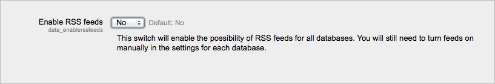

.. _database_settings:

Database
=========
Database activity defaults and additional settings may changed by an administrator in *Administration > Site administration > Plugins > Activity modules > Database*. 

Enable RSS feeds
^^^^^^^^^^^^^^^^^
You can choose whether you want to enable RSS feeds for all databases or not. 

