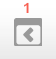

.. _dock:

Dock
=====
The dock is an area where blocks can be moved to and from this area with the block to dock (1) and dock to block (2) icons.

.. image:: _images/undock.png

Dock area and dock tool
------------------------
The dock area with 5 docked blocks and a block with the dock tool

The "docked" blocks appear as vertical tabs along the left margin attached to the page. 

The docked block can expand into a menu with a click on the tab in the dock area. Clicking on the dock icon when a block is in the docked position, will move the block back to its original position.

