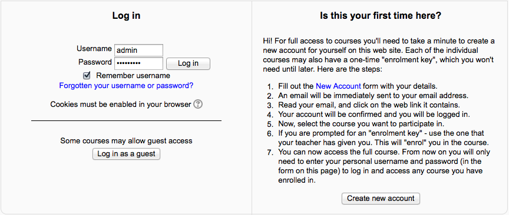

.. _email-based_self_registration:

Email Based Self Registration
==============================
The email-based self-registration authentication method enables users to create their own accounts via the 'Create new account' button on the login page. They then receive an email at the address they specified in their account profile to confirm their account. 

Enabling email-based self-registration
----------------------------------------
An administrator can enable email-based self-registration in *Administration > Site administration > Plugins > Authentication > Manage authentication*.

In addition to enabling the plugin, email-based self-registration must be selected from the self registration drop-down menu in the common settings.

**Warning:** Enabling self registration results in the possibility of spammers creating accounts in order to use forum posts, blog entries etc. for spam. This risk can be minimized by limiting self registration to particular email domains with the allowed email domains setting in *Administration > Site administration > Plugins> Authentication > Manage authentication*. Alternatively, self registration may be enabled for a short period of time to allow users to create accounts, and then later disabled.

**Note:** The Email-based self-registration authentication plugin must be enabled to allow users who previously self-registered to login. Selecting Email-based self-registration as the self registration method allows potential users to self register. 

Enable reCAPTCHA element
--------------------------
A CAPTCHA is a program that can tell whether its user is a human or a computer. CAPTCHAs are used by many websites to prevent abuse from bots, or automated programs usually written to generate spam. No computer program can read distorted text as well as humans can, so bots cannot navigate sites protected by CAPTCHAs.

Email confirmation message
----------------------------
An automated email confirmation message is sent to the user using the support contact email address.

You can change this text in *Administration > Site administration > Language > Language customization* by choosing the appropriate language pack. selecting 'moodle.php' from 'core' and searching for the string identifier name 'emailconfirmation' and editing it with a local customization. 

Support contact
-----------------
An administrator can specify a support name, email and/or support page in *Administration > Site administration > Server > Support contact8 for including in the confirmation email. 
