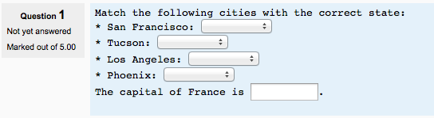

.. _embedded_answers_question_type:

Embedded Answer question type
==============================
Embedded answers (Cloze) questions consist of a passage of text (in Moodle format) that has various answers embedded within it, including multiple choice, short answers and numerical answers. 

Question set-up
----------------
    
  1. Select the question category
  2. Give the question a descriptive name - this allows you to identify it in the question bank.
  3. Enter the passage of text (in Moodle format - see Format below) into the 'question text' field.
  4. Select an image to display if you want to add a picture to the question. For the student, it appears immediately above the question text.
  5. Set the 'default question grade' (i.e. the maximum number of marks for this question).
  6. Set the 'Penalty factor' (see Penalty factor below).
  7. If you wish, add general feedback. This is text that appears to the student after he/she has answered the question.
  8. The editor has been modified and allows you to test if your syntax is good. The different questions elements decoded will be displayed and syntax errors pinpoint. However, it cannot check if the question decoded is two questions in one because of an error syntax.
  9. Click Save changes to add the question to the category. 

Example - 

.. line-block::
   Match the following cities with the correct state:                    
   * San Francisco: {1:MULTICHOICE:=California#OK~Arizona#Wrong}        
   * Tucson: {1:MULTICHOICE:California#Wrong~%100%Arizona#OK}           
   * Los Angeles: {1:MULTICHOICE:=California#OK~Arizona#Wrong}          
   * Phoenix: {1:MULTICHOICE:%0%California#Wrong~=Arizona#OK}             
   The capital of France is {1:SHORTANSWER:%100%Paris#Congratulations!   
   ~%50%Marseille#No, that is the second largest city in France (after   
   Paris).~*#Wrong answer. The capital of France is Paris, of course.}.  

Penalty factor
^^^^^^^^^^^^^^^
The 'penalty factor' only applies when the question is used in a quiz using adaptive mode - i.e. where the student is allowed multiple attempts at a question even within the same attempt at the quiz. If the penalty factor is more than 0, then the student will lose that proportion of the maximum grade upon each successive attempt. For example, if the default question grade is 10, and the penalty factor is 0.2, then each successive attempt after the first one will incur a penalty of 0.2 x 10 = 2 points. 

Format
-------
Questions consist of a passage of text (in Moodle format) that has various sub-questions embedded within it, including

  * short answers (SHORTANSWER or SA or MW), case is unimportant,
  * short answers (SHORTANSWER_C or SAC or MWC), case must match,
  * numerical answers (NUMERICAL or NM),
  * multiple choice (MULTICHOICE or MC), represented as a dropdown menu in-line in the text
  * multiple choice (MULTICHOICE_V or MCV), represented a vertical column of radio buttons, or
  * multiple choice (MULTICHOICE_H or MCH), represented as a horizontal row of radio-buttons. 

The structure of each cloze sub-question is identical:

.. line-block:

    { start the cloze sub-question with a bracket (AltGr+7) 
    1 define a grade for each cloze by a number (optional). This used for calculation of question grading. 
    :SHORTANSWER: define the type of cloze sub-question. Definition is bounded by ':'. 
    ~ is a seperator between answer options 
    = marks a correct answer 
    # marks the beginning of an (optional) feedback message 
    } close the cloze sub-question at the end with a bracket (AltGr+0) 
    
    
    
    
