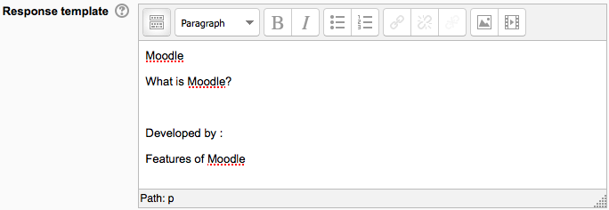
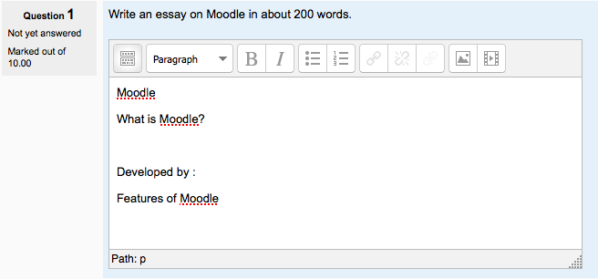

.. _essay_question_type:

Essay question type
====================
The essay question type is intended for short answers of a paragraph or two, that one often finds on exams. For longer essays, text or file uploads in an Assignment are a better choice 

Question set-up
-----------------
  1. Choose a category
  2. Give the question a descriptive name - this allows you to identify it in the question bank.
  3. Enter the question in the 'question text' field
  4. Select an image to display if you want to add a picture to the question. For the student, it appear immediately after the question text.
  5. Set the 'default question grade' (i.e. the maximum number of marks for this question).
  6. Add 'General Feedback' if required. This is text that appears to the student **after the question is graded**.
  7. Set an input box size to indicate the length of answer expected.
  8. Allow attachments if required.
  9. Add information for graders as appropriate.
  10. Click Save changes to add the question to the category. 
  
Creating a response template
^^^^^^^^^^^^^^^^^^^^^^^^^^^^^
When using the Essay question type, you can set a template which appears in the students' text editor to help them scaffold their response.

Response template in question setup screen

Student view

Question grading
-----------------
The essay question will not be assigned a grade until it has been reviewed by a teacher and manually graded. Until that happens, the student's grade will be 0.

To grade a student's answer in a quiz, follow the 'manual grading' link under Results in *Administration > Quiz administration* in your course. When manually grading an essay question, the grader is able to enter a custom comment in response to the essay and assign a score for the essay. 

Essay questions in a Lesson
-----------------------------
To grade lesson essay questions, first click on the name of the lesson in your course page. If there are essay questions to be graded, there will be a link saying "Grade essay questions". This link will open a screen showing how many ungraded essay questions there are. Ungraded essay questions will be in listed in red. Click the link for the essay you wish to grade.

The essay grading screen shows the title of the question, the student's essay response, and a place you can write optional comments and give the essay a score. Click the Submit grade button to record your score and comments. Graded questions will be displayed in green. Repeat the process to finish grading. Click the "Email graded essays" link to email your responses to your students. 

