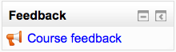

.. _feedback_block:

Feedback block
===============
The Feedback block may be added to courses to provide a quick link to global feedback activities which have been set up from the front page. 

As with the Feedback module, this block is disabled by default and must be enabled by the administrator from *Administration > Site administration > Plugins > Blocks > Manage blocks*.

