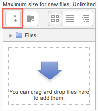
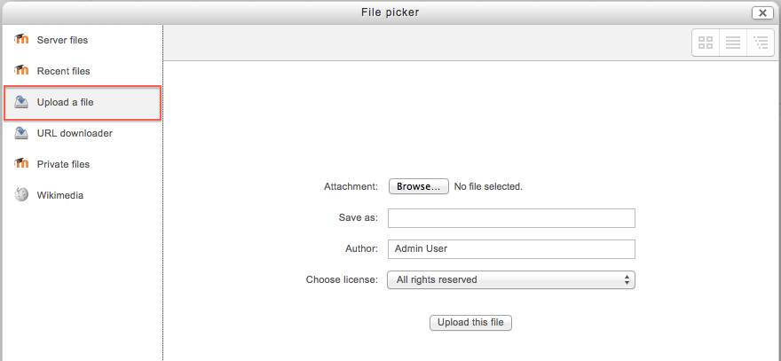
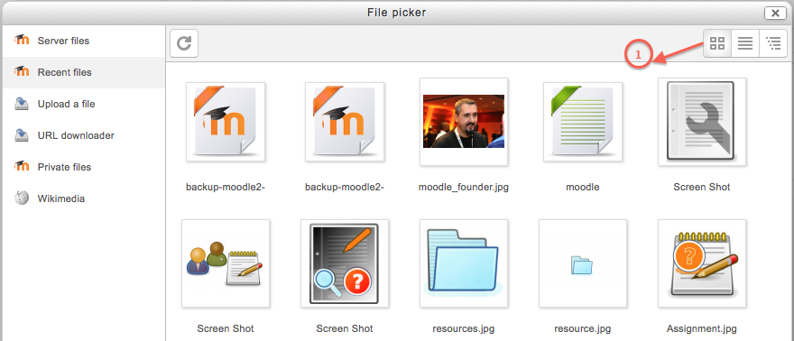
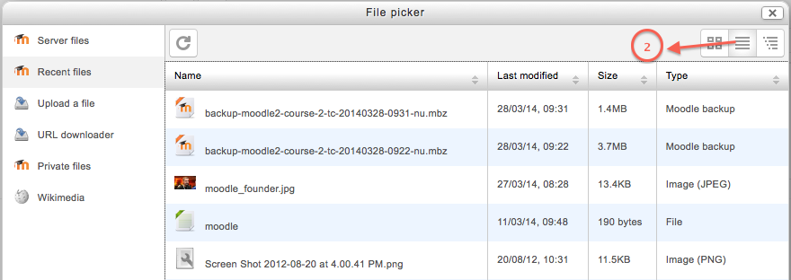
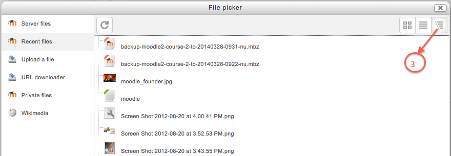

.. _file_picker:

File picker
============
The file picker enables files to be selected and displayed in Moodle - for example, when an editing teacher clicks Add an activity or resource > File, or when a forum participant adds an attachment to a post.

Usually the file is copied into Moodle from wherever you have chosen it from (e.g. a repository or your computer), though for certain repositories, such as the Youtube videos repository, a link is created, and in some situations an alias/shortcut may be created.

An "add" button appears which is clicked on to access the file picker.

Getting files from the file picker
------------------------------------
When the file picker screen appears, a number of links are listed down the side. These are links to Repositories which hold files you might want to use. There is also a link Upload a file which you would click on to add a file yourself from your computer.

Which repositories are included depends on which ones have been enabled by the administrator and also the context in which you access the file picker. For example, if you have reached the file picker by clicking on the media icon in the TinyMCE text editor then you might see the Youtube videos repository link. If you have reached the file picker by clicking on the image icon in the TinyMCE text editor then you might see the Flickr repository repository link. 

**Note:** The order in which repositories are listed in the file picker is set by an administrator in *Administration > Site administration > Plugins > Repositories > Manage repositories*. 

Viewing your files in the file picker
--------------------------------------
There are three ways to view files in the File picker, depending on your personal preference;

**View as icons**

This shows the files as easily identifiable thumbnails.

**View as table**

This shows the files with details such as licence, date uploaded, size etc.

**View as a list**

This shows the files in a hierarchical list.

