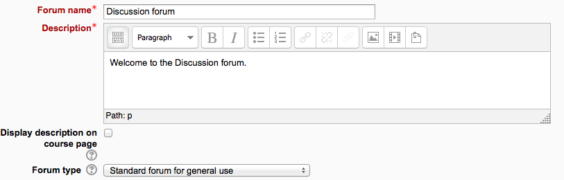
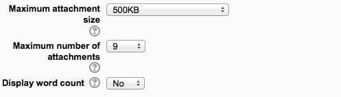
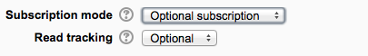
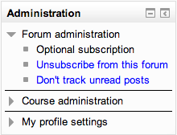
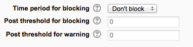
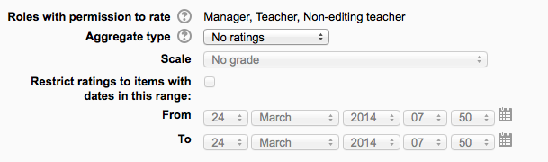
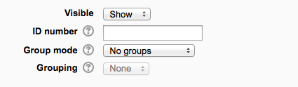

.. _forum:

Forum
======
The forum module is an activity where students and teachers can exchange ideas by posting comments. There are four basic forum types. Forum posts can be graded by the teacher or other students. 

A forum can contribute significantly to successful communication and community building in an online environment. You can use forums for many innovative purposes in educational settings, but teaching forums and student forums are arguably the two more significant distinctions.

Adding and editing a forum
---------------------------

  1. With the editing turned on, in the section you wish to add your forum, click the "Add an activity or resource" link (or, if not present, the "Add an activity" drop down menu) and choose *Forum*.
  2. This will take you to the forum settings page titled "Adding a new forum". 

In an existing forum, the following settings can be found in *Settings > Forum administration > Edit settings*.

General
^^^^^^^^

**Forum name**

A short name of the forum (e.g. "Moodle"), which will be displayed on the course homepage.

**Description**

Provide instructions for your students here so they are clear what they have to do. Click the icon top left to expand the toolbars drag the bottom right of the text box out to expand it.

**Display description on course page**

Enabling this will display the description on the course page just below the link to the forum.

**Forum type**

There are five forum types to choose from: 
  * **A single simple discussion** - A single topic discussion developed on one page, which is useful for short focused discussions (cannot be used with separate groups)
  * **Standard forum for general use** - An open forum where anyone can start a new topic at any time; this is the best general-purpose forum
  * **Each person posts one discussion** - Each person can post exactly one new discussion topic (everyone can reply to them though); this is useful when you want each student to start a discussion about, say, their reflections on the week's topic, and everyone else responds to these
  * **Q and A Forum** - Instead of initiating discussions teacher poses a question in the initial post of a discussion. Students may reply with an answer, but they will not see the replies of other Students to the question, until they have themselves replied to it.
  * **Standard forum displayed in a blog-like format**
  
A :ref:`News forum <news_forum>` is a special type of forum that is automatically created with a new course. 

Attachments and word count
^^^^^^^^^^^^^^^^^^^^^^^^^^^
(This setting is collapsed by default) 

**Maximum attachment size**

The maximum file size that may be attached to a forum post will first be determined by the Moodle site settings. The teacher may want a smaller size limit for the forum. Server file capacity, student downloading speeds and discouraging images in a document centered discussion are a few reasons to limit file size.

**Maximum number of attachments**

The maximum number of attachments a user can add to their forum post (from 0 to 100) can be specified here.

**Display word count**

If "Display word count" is enabled, then the number of words in forum posts will be shown at the bottom of each post. 

Subscription and tracking
^^^^^^^^^^^^^^^^^^^^^^^^^^
(This setting is collapsed by default) 

**Subscription mode**

When a user is subscribed to a forum it means that they will receive notification (via popup and/or email, depending on the user’s messaging settings preferences) of each new posting. By default, posts are recorded about 30 minutes after the post was first written. Depending upon the email settings of each forum member, they may be sent an email immediately after the 30 minute edit window is closed, or in a batch at a time fixed by the site administrator (see below).

People can usually choose whether or not they want to be subscribed to each forum. However, the teacher can choose to force subscription on a particular forum then all course users will be subscribed automatically, even those that enrol at a later time.

There are 4 subscription mode options: 

  * **Optional subscription** - Participants can choose whether to be subscribed
  * **Forced subscription** - Everyone is subscribed and cannot unsubscribe
  * **Auto subscription** - Everyone is subscribed initially but can choose to unsubscribe at any time
  * **Subscription disabled** - Subscriptions are not allowed. 

The subscription mode and subscribe or unsubscribe links appear in the Settings menu under Forum administration when viewing the forum. teachers can quickly change the mode via the 'Subscription mode' options and view the current subscribers via the 'Show/edit current subscribers' link.

**Tips:**

  * Forcing everyone to subscribe is especially useful in the news forum and in forums towards the beginning of the course (before everyone has worked out that they can subscribe to these emails themselves).
  * Changing the setting from "Yes, initially" to "No" will not unsubscribe existing users, it will only affect those who enrol in the course in the future. Similarly changing "Yes, initially" will not subscribe existing course users but only those enrolling later.
  * There is also a "Subscriptions not allowed" setting which prevents Students from subscribing to a Forum. Teachers may choose to subscribe to a forum if they wish. 

**Read tracking for this forum?**

"Read tracking" for a forum allows users to track read and unread forum posts.

There are three options for this setting:

  * Optional - Students can turn tracking on or off for the forum via a link 'Track / Don't track unread posts' in Administration > Forum administration, or via their profile 'Forum Tracking' option.
  * Off - It is not possible to track unread forum posts
  * Forced - Tracking is always on in this forum, regardless of user preference or setting. No link in is present in Administration > Forum administration. This setting is only available when the 'Allow forced read tracking' administrative setting is enabled.

RSS
^^^^
(This setting is collapsed by default and will only appear if RSS has been enabled sitewide and for forums) 

**RSS feed for this activity**

This turns RSS on or off for this forum. When set to “None,” RSS is disabled. When set to “Discussions,” the RSS feed will send out new discussions to subscribers. When set to “Posts,” the RSS feed will send out any new posts to subscribers.

**Note:** RSS feeds must be enabled for the site and for forums in order for the RSS settings to appear.

**Number of RSS recent articles**

This number sets the number of articles that go out via RSS. If this number is set to 5, then the 5 most recent articles will be sent to subscribers. As new posts (or discussions) get added, the oldest post/discussion gets replaced on the RSS feed. If your forum gets a lot of posts every day, you will want to set this number high.

The administrative cron (admin/cron.php) must run after the forum is created and posts or discussions have been made. Otherwise the user will receive an error "Error reading RSS data" 

Post threshold for blocking
^^^^^^^^^^^^^^^^^^^^^^^^^^^^^
(This setting is collapsed by default)

**Time period for blocking**

Choose here the time period in which can be blocked from posting more than a given number of posts. (To make a user exempt, give them the capability mod/forum:postwithoutthrottling)

**Post threshold for blocking**

Set the number of posts here that users may add before they are blocked.

**Post threshold for warning**

Set the number of posts here after which users will be warned they are about to be blocked. 

Grade
^^^^^^
(This setting is collapsed by default) Choose the category in which this forum will appear if ratings are enabled. 

Ratings
^^^^^^^^
(This setting is collapsed by default) 

**Roles with permissions to rate**

Forum posts can be rated using a scale. By default, only teachers can rate forum posts, though students can be given permission to do so if desired (see Forum permissions below). This is a useful tool for giving students participation grades. Any ratings given in the forum are recorded in the gradebook.

**Aggregate type**

You can set an aggregate type, in other words, decide how all the ratings given to posts in a forum are combined to form the final grade (for each post and for the whole forum activity).See Ratings for an explanation of aggregate types and which one is best for you.

**Restrict ratings to items with dates in this range**

The teacher can allow only posts within a certain date range to be rated. This is useful if the teacher wants to keep students focused on the most recent content and maintain a specific pace within the forum or course. 

Common module settings
^^^^^^^^^^^^^^^^^^^^^^^
(These settings are collapsed by default) 

See :ref:`Common module settings <common_module_settings> for more information, but note the details below relating specifically to use of forums with groups. 

**Group mode**

The group mode setting has three options:

  * No groups
  * Separate groups - each group can only see their own group; others are invisible
  * Visible groups - each group works in their own group, but can also see other groups 

If the group mode is set to separate groups: 

  * Teachers are given the option of adding a new discussion topic for all participants or for a selected group. If a teacher adds a new discussion topic for a selected group, then only group members can reply to it. If a teacher adds a new discussion topic for all participants, then students can't reply to it. (This is to ensure that groups are kept separate.)
  * Students can only start discussions for their own group.
  * Students can only reply to discussions started by other group members or discussions for their own group started by a teacher. 

If the group mode is set to visible groups:

  * Teachers are given the option of adding a new discussion topic for all participants or for a selected group. If a teacher adds a new discussion topic for a selected group, then only group members can reply to it.
  * Students can only start discussions for their own group.
  * Students can only reply to discussions started by other group members or teachers. 

Teachers, and other users with the capability moodle/site:accessallgroups set to allow, can view and post in all forum discussions, regardless of the group mode setting.

**Note:** Single simple discussions cannot be set to separate groups (as this feature is not implemented). Instead, a standard forum should be used, with the teacher copying and pasting the same discussion topic for each separate group. If required, a permissions override may be set to prevent students from starting new discussions. 

Restrict access / Activity completion
^^^^^^^^^^^^^^^^^^^^^^^^^^^^^^^^^^^^^^
The :ref:`Restrict access <restrict_access_settings>` area becomes visible in Moodle activities and resource settings if :ref:`Conditional Activities <conditional_activities_settings> have been enabled. 

Locally assigned roles
^^^^^^^^^^^^^^^^^^^^^^^
In Administration > Forum administration > Locally assigned roles selected users can be given additional roles in the activity.

**Forum moderator**

A student can be given the rights to moderate a forum by assigning them the role of non-editing teacher in the forum.

  1. In *Administration > Forum administration > Locally assigned roles* click on student
  2. Select the student from the potential users list on the right, and use the Add button to add them to the existing users list on the left. Multiple users may be selected by holding down the Apple or Ctrl key whilst clicking on the users' names. 

Forum permissions
^^^^^^^^^^^^^^^^^^
Role permissions for the activity can be changed in *Administration > Forum administration > Permissions*.

Common permissions changes include:

**Enabling students to rate posts**

Click the Allow icon (+) opposite the capability to rate posts and allow the role of student.

**Archiving a forum**

A forum can be closed / archived so that students may no longer start new discussions, nor add replies, but can still read all the discussions by clicking the Prevent icon (X) for the student role for the capabilities 'Start new discussions' and 'Reply to posts'. 

**Guests and posting in a forum**

There are certain things, such as posting in a forum, that guests are never allowed to do, despite the permissions interface suggesting otherwise.

The guest role has some special functionality, for example when a guest user attempts to post in a forum, they obtain the message "Sorry, guests are not allowed to post. Would you like to log in now with a full user account?"

(Note: If guests don't obtain the "Sorry, guests are not allowed to post" message because they have no reply link, then self enrolment needs enabling in Settings > Course administration > Users > Enrolment methods.)

If you wish guests to be able to post in a forum, you can create a similar role, say "visitor" with very few permissions allowed, then create an account and assign it the role of visitor. Guests can then share this visitor account. 

User administration settings
^^^^^^^^^^^^^^^^^^^^^^^^^^^^^
Users can choose whether or not to track unread posts in their profile settings under 'Forum tracking'. The settings are:

  * Yes: highlight new posts for me
  * No: don't keep track of posts I have seen 

If the user chooses 'Yes: highlight new posts for me' and the forum administrator has set the 'Read tracking for this forum?' to On or Optional then the user will have new posts highlighted for them. 

The posts will be highlighted in the following places:

  * My home page
  * Course page
  * Within the forum itself
  * In forum discussion threads 
  

