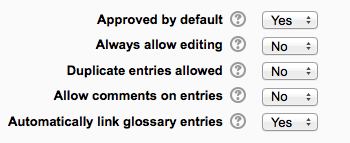

.. _glossary:

Glossary
=========

.. image:: _images/glossary_1.png

The glossary activity module allows participants to create and maintain a list of definitions, like a dictionary.

Glossary can be used in many ways. The entries can be searched or browsed in different formats. A glossary can be a collaborative activity or be restricted to entries made by the teacher. Entries can be put in categories. The auto-linking feature will highlight any word in the course which is located in the glossary. 

Adding a glossary
------------------
To add a glossary:

  1. With the editing turned on, in the section you wish to add your glossary, click the "Add an activity or resource" link (or, if not present, the "Add an activity" drop down menu ) and choose Glossary. All settings may expanded by clicking the "Expand all" link top right. 
    
General
^^^^^^^^

**Name**

Give your new glossary a descriptive name.

**Description**

Describe the purpose of the glossary and provide instructions or background information, links etc. Click the icon top left to expand the toolbars, and drag the bottom right of the text box out to expand it.

**Display description on course page**

If this box is ticked, the description will appear on the course page just below the name of the glossary. 

**Is this glossary global?**

Administrators can make a global glossary, with entries linking throughout the whole Moodle site. Any course may contain a global glossary, though the best practice is to place a global glossary on the site front page.

**Glossary type**

Here you can decide whether the glossary will be main or secondary. The glossary system allows you to export entries from any secondary glossary to the main one of the course. In order to do this, you should specify which glossary is the main one. You can only have one main glossary per course.

Entries
^^^^^^^^
(These settings are collapsed by default) 

**Approved by default**

If set to "yes" then new entries appear automatically. If not, then the teacher must approve each one first.

**Always allow editing**

If set to "yes", students can edit their entries at any time. If not, then they can only edit for a certain period.

**Duplicate entries allowed**

This allows the entry of more than one definition for a given word.

**Allow comments on entries**

Students and teachers can leave comments on glossary definitions. The comments are available through a link at the bottom of the definition.

**Automatically link glossary entries**

If the Glossary auto-linking filter is enabled by an administrator, then turning this on allows individual entries in this glossary to be automatically linked whenever the concept words and phrases appear throughout the rest of the same course. This includes forum postings, internal resources, week summaries and so on. 

**Note:** Enabling linking for the glossary does not automatically turn on linking for each entry - linking needs to be set for each entry individually. If you do not want particular text to be linked (in a forum posting, say) then you should add <nolink> and </nolink> tags around the text. Note that category names are also linked. 

Appearance
^^^^^^^^^^^
(These settings are collapsed by default) 

.. image:: _images/glossary_4.png

**Display format**

That specifies the way that each entry will be shown within the glossary. The default formats are:

  * **Simple, dictionary style** - This looks like a conventional dictionary with separate entries. No authors are displayed and attachments are shown as links.
  * **Continuous without author** - Like the simple style. Shows the entries one after other without any kind of separation but the editing icons, but only if your theme supports it, you usually have to modify the theme if you want an alternative appearance to the simple setting.
  * **Full with author** - A forum-like display format showing author's data. Attachments are shown as links.
  * **Full without author** - A forum-like display format that does not show author's data. Attachments are shown as links.
  * **Encyclopedia** - Like 'Full with author' but attached images are shown inline.
  * **Entry list** - This lists the concepts as links.
  * **FAQ** - Useful for displaying lists of frequently asked questions. It automatically appends the words QUESTION and ANSWER in the concept and definition respectively. 

**Approval display format**

It is possible to set an alternative display format for when entries are approved that can differ from the display format on the course page. This could be useful for instance if a tutor wants to see who made a particular glossary entry before approving it but doesn't want the students' name to be displayed for others on the course page.

**Entries shown per page**

Decid here how many entries to show per page.

**Show alphabet links**

If set to "yes", users can browse the glossary by letters of the alphabet.

**Show 'ALL' link**

If set to "yes", users can browse all the entries at once

**Show 'Special' link**

If set to "yes", users can can browse the glossary by special characters, such as @ and #.

**Allow print view**

This provides a printer-friendly version link for students. (Teachers are always provided with a printer-friendly version link.) 

RSS
^^^^
(These settings are collapsed by default and only visible if RSS has been enabled on the site and for the glossary.) 

**RSS feed for this activity**

This turns RSS on or off. When set to “None,” the RSS feed is disabled. When set to “Concepts with authors,” the RSS feed will send out the glossary entries with the name of the author. When set to “Concepts without authors,” the RSS feed sends out glossary entries without the name of the author.

**Number of RSS recent articles**

This number sets the number of entries that go out via RSS. If this number is set to 5, then the 5 most recent articles will be sent to subscribers. As new entries get added, the oldest entry gets replaced on the RSS feed. If your glossary gets a lot of posts every day, you will want to set this number high.

When RSS is enabled for your glossary, an orange RSS button appears on the main page (in the upper right-hand side). When a user clicks on the RSS button, they see the XML code displayed, needed by the news-reader. Once a user has the RSS news-feed link, adding it to a reader is simple and will then display Glossary aggregated information, along with other information they subscribe to.

Grade
^^^^^^
(This setting is collapsed by default) Choose the category in which this glossary will appear if ratings are enabled. 

Ratings
^^^^^^^^
(This setting is collapsed by default) 

**Roles with permissions to rate**

Glossary entries can be rated using a scale. By default, only teachers can rate glossary entries, though students can be given permission to do so if desired from Administration>Glossary administration. This is a useful tool for giving students participation grades. Any ratings given are recorded in the gradebook. 

Common module settings
^^^^^^^^^^^^^^^^^^^^^^^
(These settings are collapsed by default.)

See :ref:`Common module settings <common_module_settings>`

Restrict access/Activity completion
^^^^^^^^^^^^^^^^^^^^^^^^^^^^^^^^^^^^^
(These settings are collapsed by default)

These settings are visible if :ref:`Conditional activities <conditional_activities_settings>` and :ref:`Activity completion <activity_completion_settings>` have been enabled in the site and the course.

Glossary permissions
^^^^^^^^^^^^^^^^^^^^^^
Role permissions for the activity can be changed in *Administration > Glossary administration > Permissions*.

