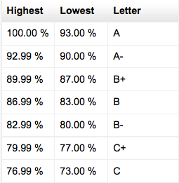
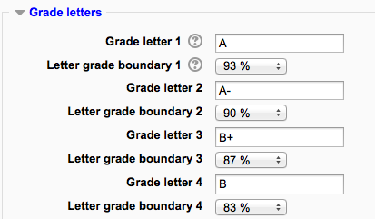

.. _grade_letters:

Grade Letters
===============
Grade letters, also called letter grades, are symbols used to represent a range of grades. For example "A" could be used to represent grades of 80% and above, "B" to represent grades between 70 and 80%, "C" to represent grades between 50 and 70%, and so on. Alternatively, you could have "Pass" for grades above 50% and "Fail" for grades below 50%. 

Displaying letter grades
--------------------------

To change particular grade items, category and course summaries (called aggregations) in the grader report and user reports to display letter grades:

    1. Follow the grades link in the course administration block.
    2. Select "Categories and items" from the gradebook dropdown menu.
    3. Click the edit icon for Category total or Course total.
    4. From the Grade display type menu, select letter.
    5. Click the "Save changes" button at the bottom of the page. 

Repeat this for any other totals that you want displayed as letters.

Alternatively, to display ALL grades as letter grades:

    1. Follow the grades link in the course administration block.
    2. Select "Course settings" from the gradebook dropdown menu.
    3. From the Grade display type menu, select letter.
    4. Click the "Save changes" button. 
    
    
Editing course-level grade letters
------------------------------------
Grade letters are set initially at site level. To use different grade letters in a particular course:

    1. Follow the grades link in the course administration block.
    2. Select Letters from the from the gradebook dropdown menu.
    3. Click the edit tab in the middle of the page.
    4. Check the override site defaults box.
    5. Change grade letters and/or boundaries as required. (You may wish to use words, for example Below Pass, Pass, Merit, Distinction, rather than letters.)
    6. Scroll to the bottom of the page and click the "Save changes" button. 

Setting grade letter site-level defaults
------------------------------------------
To set grade letter site defaults:

    1. Login as an administrator.
    2. Access *Administration > Site administration > Grades > Letters*.
    3. Change grade letters and/or boundaries as required.
    4. Scroll to the bottom of the page and click the "Save changes" button. 
    

    
Forcing grade letter site-level defaults
------------------------------------------
To force grade letter site-level defaults in all courses i.e. remove the ability for teachers to override site defaults and edit grade letters in their courses:

    1. Login as an administrator.
    2. Access *Administration > Site administration > Users > Permissions > Define roles*
    3. Edit the role of teacher and change the capability moodle/grade:manageletters from Allow to Not set.
    4. Scroll to the bottom of the page and click the "Save changes" button. 
    
Accuracy of grade calculations
--------------------------------
Grade calculations are made with an accuracy of 5 decimal places and grade letters assigned accordingly. The overall decimal points setting (in the system grade item settings and for individual grade items) is for display purposes only and is not used when assigning grade letters. 

    
    
    
    
    
