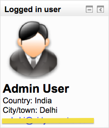

.. _logged_in_user_block:

Logged in user block
======================

The logged in user block displays certain information about the user who is currently logged in to a Moodle course: 

The information which is displayed can be selected by the course teacher by clicking on the "configure" icon of the block. A number of dropdown boxes then appear for the teacher to choose which items will appear: 
