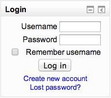

.. _login_block:

Login block
============
The Login block provides logged out users an in-site area to enter their Username and Password and login, Create a new account or retrieve/reset their password. 

This block is only of use where you are not forcing users to login before viewing any part of your site.

This block can only be added to your Moodle site via the front page but within the Block editing area, via the Block display page contexts option, you can set this block to:

  * display on the front page only; or
  * display on the front page and any pages added to the front page; or
  * display throughout the entire site 
