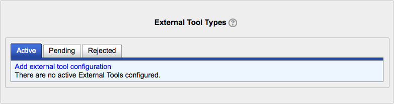

.. _lti_settings:

LTI
====
An administrator can configure external tools in *Settings > Site administration > Plugins > Activity modules > External tool* so that they are available across the site. There are tabs to add an external tool, to view those which are pending and to view those which have been rejected.

