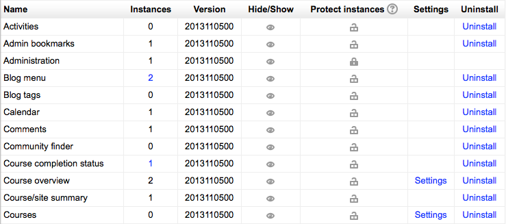

.. _manage_blocks:

Manage blocks
==============
An administrator can manage Moodle's blocks for the site in *Administration > Site administration > Plugins > Blocks > Manage blocks*, including any contributed blocks that have been added.

Instances
^^^^^^^^^^
The blocks page lists the number of instance for each block. Clicking on a number results in the list of courses containing that block being displayed. 

Version
^^^^^^^^
Listed with each block is its version number — in the format 2012061700. This is helpful to ensure that you have the latest version of each block.

Hiding a block
^^^^^^^^^^^^^^^^
The hide/show column allows selected blocks to be hidden i.e. they do not appear in any course "Add a block" dropdown menu and cannot be used in any course. To hide a block, click the eye icon so that it changes to a closed eye.

To reduce the length of course "Add a block" dropdown menus, you should hide blocks which will not be used, such as mentees (unless you have added a mentor role) and network servers (unless you are using Moodle Networking). 

Protecting blocks from deletion
^^^^^^^^^^^^^^^^^^^^^^^^^^^^^^^^^
By clicking the padlock against a block in this column, you are preventing it from being deleted on the site. The Administration block and Navigation block are already padlocked, as major difficulties arise if these blocks are deleted. Only unlock them if you are absolutely sure you understand the consequences and have alternative settings and navigation features in place. 

Block deletion
^^^^^^^^^^^^^^^^
Blocks can be deleted using the link in the delete column. There is usually no reason for standard blocks to be deleted (they are usually hidden) However, non-standard blocks may need to be deleted before upgrading.

**Note:** To delete a block completely, in addition to deleting it on the blocks page, you also need to remove/delete the actual block folder from the moodle/blocks folder, otherwise Moodle will reinstall it next time you access the site administration. 
    
Block settings
^^^^^^^^^^^^^^^
Certain blocks have additional settings, which can be accessed via the links in the settings column. 

Block capabilities
--------------------
    * Manage My home page blocks
    * Edit blocks in tags pages
    * Manage blocks on own public user profile
    * Manage blocks on user profile of other users
    * Edit a block's settings
    * View block
    * Manage blocks on a page 

In addition, every block has an *addinstance* capability (e.g. block/comments:addinstance) and most blocks also have a *myaddinstance* capability (e.g. block/comments:myaddinstance) for controlling whether a user with a particular role can add the block to a page or to their My home page respectively. 

