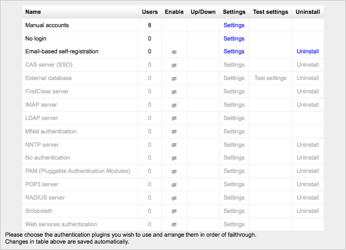
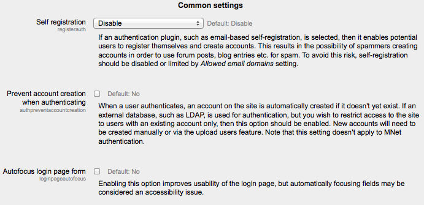

.. _managing_authentication:

Managing Authentication
========================

Setting the authentication menthod(s)
---------------------------------------
An administrator can set the authentication method(s) for the site as follows:

    Go to *Administration > Site administration > Plugins > Authentication > Manage authentication*
    Click the eye icon to enable selected authentication plugins (closed eye = disabled, open eye = enabled)
    Click the settings link opposite the authentication plugin(s) you have chosen
    Configure the required settings and click the "Save changes" button
    Repeat until you have edited all the plugins you have enabled 

More than one authentication plugin may be enabled. Any authentication plugin can be used to find a username/password match. Once found, a user is logged in and alternative plugins are not used. Therefore the plugin which handles the most logins should be moved to the top of the page in order that less load is put on authentication servers. 

Authentication common settings
--------------------------------
Authentication common settings can be changed by an administrator in *Administration > Site administration > Plugins > Authentication > Manage authentication*.

Self registration
^^^^^^^^^^^^^^^^^^^
If you wish users to be able to create their own user accounts, i.e. self-register, then select Email-based self-registration (or any other enabled plugin that can support self registration, like LDAP) from the drop-down menu. This will result in a "Is this your first time here?" instructions and a "Create new account" button being displayed on the login page.

Warning: Enabling self registration results in the possibility of spammers creating accounts in order to use forum posts, blog entries etc. for spam. This risk can be minimized by limiting self registration to particular email domains with the allowed email domains setting (see below). Alternatively, self registration may be enabled for a short period of time to allow users to create accounts, and then later disabled by setting 'Self registration' to Disable in the common settings in *Administration > Site administration > Plugins > Authentication > Manage authentication*.

**Note:** The Email-based self-registration authentication plugin must be enabled to allow users who previously self-registered to login with that plugin. Selecting Email-based self-registration as the self registration method allows potential users to self register. 

Guest login button
^^^^^^^^^^^^^^^^^^^^
You can hide or show the guest login button on the login page. Hiding the guest login button disables guest access to the Moodle site, however logged-in users can still enter any courses which allow guest access without being required to enrol. 

Alternate login URL
^^^^^^^^^^^^^^^^^^^^^
This should be used with care, since a mistake in the URL or on the actual login page can lock you out of your site. If you do mess it up, you can remove the entry from your database (table mdl_config) using, e.g., phpmyadmin for mysql. 

Forgotten password URL
^^^^^^^^^^^^^^^^^^^^^^^^
If your lost password handling is performed entirely outside of Moodle (for example, only by a help desk), you can set the url of that service here. Anybody pressing a "lost password" link in Moodle will be redirected to this URL. Note that this will disable all of Moodle's lost password recovery options regardless of authentication method(s) in use. 

Instructions
^^^^^^^^^^^^^^
The instructions field is for providing custom login instructions on the login page. If the field is left blank then the default login instructions will be displayed. 

An alternative method of providing custom login instructions is to edit the default login instructions using the language customization feature. This method should be used if you wish to provide custom login instructions in more than one language.

    1. Go to *Administration > Site administration > Language > Language customization*
    2. Select a language then click the button 'Open language pack for editing' then click continue
    3. Select moodle.php and enter loginsteps as string identifier then click 'Show strings'
    4. Enter your custom login instructions in the local customisation text box
    5. Click the button 'Save changes to the language pack' then click continue
    6. Repeat the steps for other languages 
    
    
Allowed and denied email domains
^^^^^^^^^^^^^^^^^^^^^^^^^^^^^^^^^^
Authentication may be restricted to particular email domains when using Email-based self-registration so that, for example, only students with a university email can login. 

Restrict domains when changing email
^^^^^^^^^^^^^^^^^^^^^^^^^^^^^^^^^^^^^^
You can choose to enforce email domains only when users create an account using Email-based self-registration i.e. after creating an account, users may change their email to a different domain. 

ReCAPTCHA
^^^^^^^^^^^
A CAPTCHA is a program that can tell whether its user is a human or a computer. CAPTCHAs are used by many websites to prevent abuse from bots, or automated programs usually written to generate spam. No computer program can read distorted text as well as humans can, so bots cannot navigate sites protected by CAPTCHAs. 

