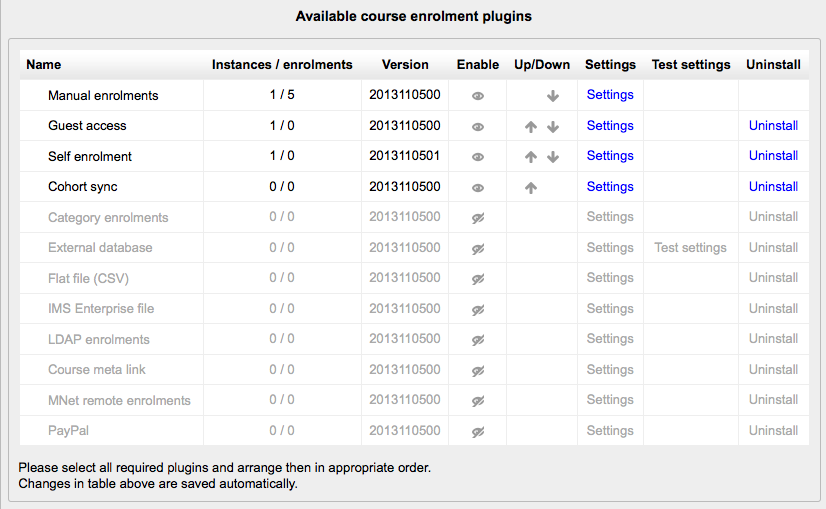

.. _managing_enrolments:

Managing Enrolments
====================
To set an enrolment method:

  1. Click on *Administration > Site administration > Plugins > Enrolments > Manage enrol plugins*.
  2. Click on the enable checkboxes opposite your chosen enrolment plugin(s). If you wish, you may choose more than one enrolment method. For example if you have some courses which students must pay for and some free courses, you can use PayPal and self enrolment.
  3. Click the "Save changes" button.
  4. Click the settings link opposite the enrolment plugin(s) you have chosen.
  5. Configure the required settings and click the "Save changes" button.
  6. Repeat until you have edited all the plugins you have enabled. 

The order in which enrolment plugins are applied can be set. This may be important for some plugins. It also affects the order of enrolment options on the course enrol page. 
