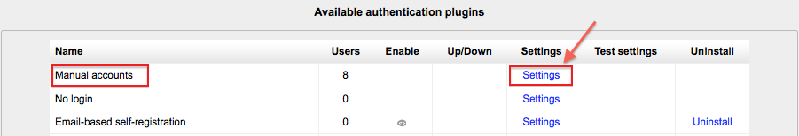

.. _manual_accounts:

Manual accounts
================
Location: *Administration > Site Administration > Plugins > Authentication > Manage authentication*.

Manual authentication is enabled by default in Moodle and requires the administrator to manually create all the user accounts. 

  
Locking user fields
---------------------
The settings page in *Administration > Site Administration > Plugins > Authentication > Manual accounts* allows for certain fields to be "locked". Users are not allowed to change the locked fields. 

