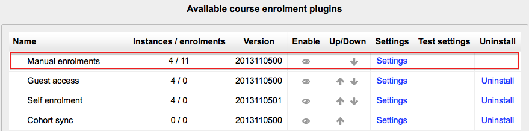
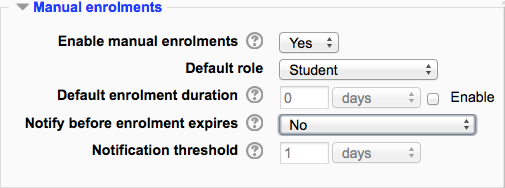
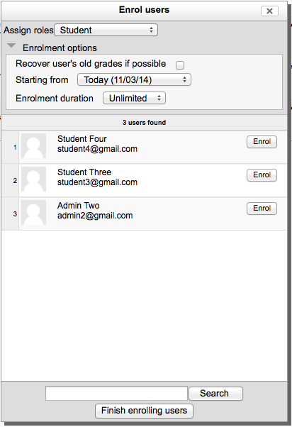

.. _manual_enrolments:

Manual Enrolments
==================
The manual enrolments plugin allows users to be enrolled manually via a link in the course administration settings. The plugin has to be enabled by the site administrator and should normally be enabled as certain other enrolment plugins, such as self enrolment, require it.

Course settings
----------------

Checking you have manual enrolment in your course
^^^^^^^^^^^^^^^^^^^^^^^^^^^^^^^^^^^^^^^^^^^^^^^^^^^
    * In a course, go to *Administration > Course administration > Users > Enrolment methods*
    * Make sure Manual enrolments has its "eye" opened. 

   
Editing manual enrolment settings
^^^^^^^^^^^^^^^^^^^^^^^^^^^^^^^^^^
Managers (and any other users with the capability enrol/manual:config) can edit the manual enrolment method in the course and set the default enrolment period and default role in *Administration > Course administration > Users > Enrolment methods*. 

It is possible also for students and/or teachers to be notified when enrolments expire by selecting either "Enroller only" or "Enroller and enrolled user" from the dropdown "Notify before enrolment expires" and a time in "Notification threshold". 

Enrolling users
-----------------
**Method 1**
    1. Go to *Administration > Course administration > Users > Enrolled users*
    2. Click the 'Enrol users' button at the top right or bottom left of the page
    3. Use the 'Assign roles' dropdown if you wish to change the role
    4. Select enrolment options as appropriate
    5. Browse or search for the user
    6. Click the Enrol button opposite the user. The user will indent in the list and the enrol button will disappear, indicating that the user is enrolled.
    7. When you have finished, click the 'Finish enrolling users' button (or simply close the enrol users box) 
    

The user will then appear in the list of enrolled users.

**Note:** The enrolment option 'Recover user's old grades if possible' is not ticked by default and is easy to miss. An admin can make it so that the checkbox is ticked for all courses on the site by enabling the setting 'Recover grades default' in *Administration > Site administration > Grades > General settings*.

**Method 2**
    1. Go to *Administration > Course administration > Users > Enrolment methods*
    2. Click the 'Enrol users' icon in the edit column opposite manual enrolment
    3. Select users from the not enrolled users list, using Ctrl + click to select multiple users
    4. Click the add button to add the users to the enrolled users list 
    
Editing individual enrolment start and end dates
^^^^^^^^^^^^^^^^^^^^^^^^^^^^^^^^^^^^^^^^^^^^^^^^^
Enrolment start and end dates may be edited for individual students as follows:

    1. Go to *Administration > Course administration > Users > Enrolled users*
    2. Click the edit icon in the enrolment methods column for a particular user.
    3. Edit dates as required, then click the 'Save changes' button. 
    
    
Admin settings
----------------
The manual enrolment plugin may be enabled or disabled site-wide in *Administration > Site administration > Plugins > Enrolments > Manage enrol plugins*.

Site-wide settings, including default settings for manual enrolment in new courses, may be set via *Administration > Site administration > Plugins > Enrolments > Manual enrolments*.

    * Enrolment expiration action - specifies what happens when user enrolments reach expiration date. Please note that option "Unenrol user from course" purges grades, group memberships, preferences and other user related data from the courses.
    * Hour to send enrolment expiry notifications - specify hour for sending expiration notifications.
    * Add instance to new courses- if this is enabled, then whenever a new course is created, manual enrolments will automatically added to new courses.
    * Enable manual enrolments - this specifies if enrol instances are enabled by default in new courses, it is strongly recommended to keep this setting enabled.
    * Default role - this sets the default role, which is normally student and may be altered by a teacher in a course.
    * Default enrolment duration - this sets the default length of enrolment in new courses.
    * Notify before enrolment expires - specifies if teacher or optionally students should be notified before the expiration.
    * Notification threshold - specify how many days should be users notified before the enrolment expiration. 
    
