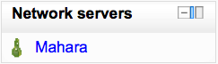

.. _mnet:

Moodle Network Authentication
==============================
The Moodle network feature allows a Moodle administrator to establish a link with another Moodle or a Mahara site and to share some resources with the users of that Moodle. Users go from the first Moodle to the linked site via the Network servers block. 

Peer to peer Network
----------------------
This is the basic layout of the system. It can be very useful to run one Moodle per faculty or departments, each with its own user management, and yet permit users to roam across the Moodle installs... subject to permissions of course.

Setup
^^^^^^
The instructions will cover 2 Moodle installations: MoodleA and MoodleB. Both are installed correctly and have never had a Moodle Network configuration.

Note: If you experience problems, ensure debugging is turned on in Settings > Site administration > Server > Debugging. Extra diagnostic messages may be displayed.

You need to first enable Networking in *Administration > Site administration > Advanced Features*. This will add the "Networking" menu to the Site Administration menu. 

  1. Get them to talk to each other
        1. Ensure *Administration > Site administration > Server > Environment* indicates you have curl installed
        2. If MoodleA and MoodleB are hosted in the same domain, ensure they have a different cookie prefix. Note that changing the cookie prefix will log you out! You can change the cookie prefix via Admin > Server > Session Handling.
        3. On both, go to *Administration > Site administration > Network > Settings* and turn Networking ON.
        4. On MoodleA go to *Administration > Site administration > Network > Manage peers* - put the URL of MoodleB under "Add New Host" and click Add. The URL should include the directory where your Moodle code is located and may include the protocol as well, for example https://www.mymoodle.org/moodle.
        5. Do the equivalent on MoodleB. 
  2. Get user roaming going
  

  
        1. (Although discussion exists about removing this setting, it is still required as of 2.0.1) [1] ). On both servers:
            a. Go to *Administration > Site administration > Plugins > Authentication > Manage authentication*. Enable MNet Authentication by clicking the 'enable' icon. 
        2. On MoodleA go to *Administration > Site administration > Networking > (Manage) Peers*, click on 'MoodleB', and click on the 'Services' tab. Enable SSO-IDP (SSO Identity Provider) publish and subscribe, and SSO-SP (SSO Service Provider) publish and subscribe.
        3. Do the equivalent on MoodleB. (By both publishing and subscribing you allow users to move freely between the two servers. By only publishing or subscribing between servers you create a one way traversal)
        4. On both, go to *Administration> Site administration > Users > Permissions > Define Roles*, only roles that have "Roam to a remote Moodle moodle/site:mnetlogintoremote" will be allowed to roam. Grant the privilege as appropriate.
            a. eg. enabling for Authenticated user allows any authenticated user to roam between servers. 
        5. On both servers, go to the homepage, and add the 'Network Servers' block.
        6. To test, it is recommended to use a different browser (even on a different machine) that is logged in to neither. Login to MoodleA with a non-administrator account that has the permissions to roam. You should see the Network Servers block, and clicking on it you should go to MoodleB with a newly autocreated account. 
  3. Get remote enrolments going -- this is optional. It allows an administrator of MoodleB to enrol users that are "native" to MoodleB in remote courses in MoodleA, and viceversa.
        1. On both, go to *Administration > Site administration > Plugins > Enrolments > Manage enrol plugins* and enable Moodle Network enrolment plugin (click Save). Click on 'Edit' and enable 'allow_allcourses' or select some courses or categories to be remotely enrolled.
        2. On the server you want to receive enrolments:
            1. Go to *Administration > Site administration > Plugins > Enrolments > Manage enrol plugins*. Enable MNet remote enrolments by clicking the 'enable' icon.
        3. On MoodleA go to *Administration > Site administration > Network > Peers*, click on 'MoodleB', and click on the 'Services' tab. Enable Enrolment publish and/or subscribe.
        4. Do the equivalent on MoodleB.
        5. On every course you want to allow enrolments into:
            1. Enter course and go to *Administration > Course administration > Users > Enrolment methods*.
            2. From Add method drop-down select MNet remote enrolments
            3. On the new screen select the Remote host you want to allow enrolments from, the Role for the enrolled users, and click save. (Note: you can only add a single MNet remote enrolments method per course.) 
            
Using it
^^^^^^^^^^
  1. In MoodleA go to *Administration > Site administration > Networking > Remote enrolments client*. You will see MoodleB listed. Click on Edit enrolments button beside MoodleB and you will see a list of courses that MoodleB offers for remote enrolment. Click 'Edit enrolments, select the users you want to enroll, and then click Add to enroll them in the course. 

Connecting to a Mnet hub
--------------------------
A Mnet hub is a Moodle server that is configured to accept connections from other Moodle servers, and to provide a set of services to users of these other servers. This guideline will direct you to connect to a Mnet hub, assess the services it has to offer, and enable those services for your users. 

Setup
^^^^^^

  1. Get talking to the Hub
        1. Ensure that the Admin > Server > Environment page indicates you have curl and openssl installed
        2. Go to Admin > Network > Settings and turn Networking on
        3. Go to Admin > Network > Peers and enter the URL of Mnet Hub under "Add New Host". Click Add
        4. The host details for the Mnet Hub should appear with the Site Name field already populated. Click Save changes
        5. The details will be written to your database and two new tabs will appear in this window: 'Services' and 'Logs'. Click Services
        6. A list of services will appear, each with a checkbox for 'publish' and 'subscribe'. Check the checkboxes for any services you want to publish or subscribe to 

Using it
^^^^^^^^^
If the Mnet Hub has already enabled a service for you, there will be a tick alongside the appropriate checkbox, for example: if the Hub is publishing Moodle Networked Enrolment, then a tick will appear alongside the subscribe checkbox for this service. Note that in order to enable some functionality, prominently single-sign-on, you may have to publish a service, e.g. the Identity Provider service. The Mnet Hub will access this service on your Moodle, asking it to authenticate your users. 

  1. Enable Roaming
        1. Subscribe to SSO (Service Provider) by checking the box
        2. Publish SSO (Identity Provider) by checking the box
        3. Click Save changes
        4. Go to Admin > Users > Permissions > Define Roles, and grant the capability Roam to a remote Moodle moodle/site:mnetlogintoremote to an appropriate role
        5. Go to Administration > Plugins > Authentication > Manage authentication and enable the Moodle Network authentication plugin
        6. Go to your homepage, turn on editing, and add the 'Network Servers' block
        7. Using a different web-browser, log on as a non-admin user who inhabits the role you granted the roaming capability to
        8. Note that the Mnet Hub is listed in the Network Servers block on the homepage. Click on the link to that server
        9. Some of your user details will be transferred to the Mnet Hub server, and a browsing session will be started for you as if you had logged on there directly 
 
  2. Enable Networked Enrolment
        1. Return to the web browser you've been using as the site administrator
        2. Go to Admin > Network > Peers and click on the entry for the Mnet Hub.
        3. Click on the Services tab
        4. Subscribe to Moodle Networked Enrolment
        5. Go to Site administration > Plugins > Enrolments > Manage enrol plugins and enable the Moodle Network enrolment plugin. Click Save changes
        6. Click on edit to view the details for networked enrolments.
        7. Go to Admin > Networking > Enrolments to see a list of Moodle servers that offer this service to you
        8. Click on a server name to view a list of courses that the server offers to your users
        9. Click on a course name, to view a list users that you can enrol in this course
        10. Enrol users
        
        
Running a Mnet hub
--------------------
A Mnet hub is a regular Moodle site that runs in a special mode. As a Moodle Administrator, when you add another Moodle site to your list of network peers, your Moodle will contact that site to find out what it is called, and to request its public key for encrypted communication. Normally, the remote server will simply provide this information without making any record of the transaction.

A Mnet hub is different. As soon as you add an entry for a Mnet hub to your system, the Mnet hub will create an entry for your server in its list of hosts, and may immediately begin to offer services to the users of your site.

This section will guide you to set up a Mnet hub, and select services to offer to all comers. 

Setup
^^^^^^^
Enable Networking

    1. Ensure that the *Administration > Site administration > Server > Environment* page indicates you have curl and openssl installed
    2. Go to *Administration > Site administration > Network > Settings* and turn Networking on
    3. Go to *Administration > Site administration > Network > Peers* and tick the checkbox for Register all hosts. Click on Save Changes
    4. On the same page, the first entry in your list of hosts should be All hosts. Click this link
    5. Click on Services and enable any services you want to offer to all comers 
        
        

