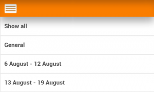
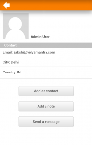

.. _mobile_app:

Mobile App
===========

Features
----------
Moodle Mobile is the Moodle official mobile application for Android and iOs. It's available in Google Play and Apple Market.

    * Responsive design for phone and tablets
    * Upload a picture into your private file area
    * Record an audio file and upload it into your private file area
    * Send a private message to a course participant (can be done offline)
    * Take a personal note about a course participant (can be done offline)
    * Add a course participant to your phone contact
    * Call a course participant touching the phone number
    * Locate a course participant address on Google map
    * Download and view some resources
    * Quick access to your course contents
    * View calendar events (require Moodle 2.5.5 or Moodle 2.6.2 and onwards)
    * Mobile notifications (Push) (from Moodle.org or any site starting Moodle 2.7)
    * Remote layout/style customization (see below) 

Notice that Moodle Mobile is not a replacement of the MyMobile or Bootstrap/Simple theme. Moodle Mobile offers offline contents, camera & audio features and (in a future) Push notifications. You can use Moodle Mobile app in combination with a Mobile theme. 

Screenshots
^^^^^^^^^^^^^

.. image:: _images/homepage.png      

.. image:: _images/activity.png

.. image:: _images/participant.png 

Style customization
^^^^^^^^^^^^^^^^^^^^^
The app can also retrieve your custom styles from your Moodle site. Since the app is a HTML5 app, you can apply safely any CSS, CSS2 and CSS3 style.

In your Moodle installation go to Plugins / Web services / Mobile and enter in the mobilecssurl field a valid URL pointing to a CSS file containing your custom styles. The original styles to override can be found here: https://github.com/moodlehq/moodlemobile/tree/master/css

The CSS should be placed inside your Moodle installation (in your custom theme or inside a local plugin)

Once the user is logged in the app, there is a periodical process that retrieves your remote CSS files for applying your custom styles.

Notice that on the first time a user opens the app, he will see the default "orange" style. Your custom styles will be applied once the user has added a site in the app. 

