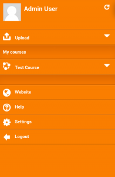
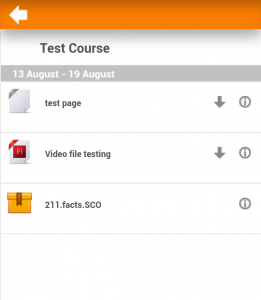
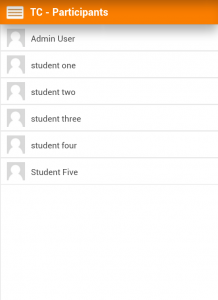

.. _mobile_app:

Mobile App
===========

Features
----------
Moodle Mobile is the Moodle official mobile application for Android and iOs. It's available in Google Play and Apple Market.

    * Responsive design for phone and tablets
    * Upload a picture into your private file area
    * Record an audio file and upload it into your private file area
    * Send a private message to a course participant (can be done offline)
    * Take a personal note about a course participant (can be done offline)
    * Add a course participant to your phone contact
    * Call a course participant touching the phone number
    * Locate a course participant address on Google map
    * Download and view some resources
    * Quick access to your course contents
    * View calendar events (require Moodle 2.5.5 or Moodle 2.6.2 and onwards)
    * Mobile notifications (Push) (from Moodle.org or any site starting Moodle 2.7)
    * Remote layout/style customization (see below) 

Notice that Moodle Mobile is not a replacement of the MyMobile or Bootstrap/Simple theme. Moodle Mobile offers offline contents, camera & audio features and (in a future) Push notifications. You can use Moodle Mobile app in combination with a Mobile theme. 

Screenshots
^^^^^^^^^^^^^

   .. image:: _images/content.png     

   .. image:: _images/profile.png
