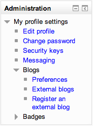

.. _navigation:

Navigation
===========
There are two standard blocks on every page - the Navigation block and the Administration block. 

Navigation block
------------------
The :ref:`Navigation block <navigation_block>` provide easy access to view various sections of the Moodle site and includes

 .. image:: _images/navigation_block1.png

 * My home - a personalised home page displaying links to the courses a user is associated with and activity information (such as unread forum posts and upcoming assignments)
 * Site pages - links to site pages and resources from the front page of Moodle
 * My profile - quick links allowing a user to view their profile, forums posts, blogs and messages as well as manage their private files
 * My courses - a link to the user's :ref:`My home <my_home>` page where they see courses they are enrolled in. 

**Note:** It is recommended that you do not use the Back and Forward buttons on your web browser when using Moodle. Using the Navigation links provided will ensure you always see the latest version of a page (eg a forum with all posts). Be careful to update, save or post any changes you make before moving on to another page to avoid losing your work.

Keyboard support for navigation
^^^^^^^^^^^^^^^^^^^^^^^^^^^^^^^^^
Keyboard/Screenreader and Voice input users can access navigation by using the Tab, Space, Enter and right/left arrow keys. 

Administration block
----------------------
The Administration block provides you with easy access to change various settings of a Moodle site. This block shows contextual settings (the settings for a forum when you are viewing it as an editing user) as well as settings for anything else you have permissions for. All users have access to edit their profile and message settings from this block as well as their Blog preferences.

Site administration settings
-----------------------------
An administrator can change navigation settings, such as the default home page, and whether to show course categories in the navigation, in *Administration > Site administration > Appearance > Navigation*. 

New settings in Moodle 2.3 onwards are 'Show my course categories', 'Link admin categories' and 'Show front page activities in the navigation'.

In Moodle 2.4.2 onwards, the order in which courses are listed under My courses in the navigation may be set. Options are: sort order (i.e. the order set in *Administration > Site Administration > Courses > Add/edit courses*) or alphabetically by course full name, course short name or course ID number.

If *Show course full names* is enabled, courses in the Navigation block will be shown with their full name rather than their short name. 

Note for administrators
-------------------------
If you are not directly associated with a course (that is, if you don't have a teacher, student or other role actually defined in the course) it will not appear in your Navigation menu. Also, if you are not directly associated with at least one course in a category, the category will not appear in your Navigation menu. 

