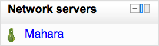

.. _network_servers_block:

Network servers
================
The Network Servers block allows you to roam to other Moodle (or Mahara) servers. Works in conjunction with the 'Can roam to other Moodles' permission which allows a user to roam to another Moodle site which is part of a Moodle Network. The Moodle Network (MNet) feature allows a Moodle administrator to establish a link with another Moodle, and to share some resources with the users of that Moodle. 

