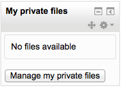

.. _private_files:

Private files
==============
In Moodle, each user has a private files area for uploading and managing a set of files.

The private files area is accessible via *Navigation > My home > My profile > My private files* or the My private files block. If the private files repository is enabled by a site admin, it is available as a source within the filepicker when selecting files to use in a course. 

Private files management
--------------------------
To add a file to your private files area

    1. On the Navigation menu, click *My profile > My private files*
    2. The file manager will appear.
    3. If desired, create a folder for your file(s)
    4. Click on the Add button to upload from the File picker or drag and drop from your desktop. It will look like the files are already there, but they aren't until you do the next step!
    5. Click the 'Save changes' button 
