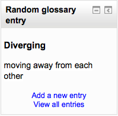

.. _random_glossary_entry_block:

Random glossary entry block
=============================
The random glossary block can be used to display random entries from a glossary, which usually take the form of dictionary style definitions. However the flexibility of Moodle's HTML editor allow users to adapt this block for other purposes such as 'Quote of the Day' or a random picture gallery that changes each time the page is refreshed. 

Before using the random glossary entry block you have to configure it using the edit icon. There you will have a number of fields to complete.

Title
^^^^^^^
Here you will write the title of that block. The default is Random Glossary Entry.

Take entries from this glossary
^^^^^^^^^^^^^^^^^^^^^^^^^^^^^^^^^
This allows you to choose from which glossary the entries in this block will be chosen.

Global glossaries are also available, (thus allowing a glossary from a course to be displayed in a block on the front page for example)

Days before a new entry is chosen
^^^^^^^^^^^^^^^^^^^^^^^^^^^^^^^^^^^
This sets the number of days for how long that a given entry is displayed. If set to "0," a new entry displays every time the page is refreshed.

How a new entry is chosen
^^^^^^^^^^^^^^^^^^^^^^^^^^^
You have four options: *Last modified entry* will always display the entry that was last modified, and *Random entry* will choose a new one at random every time. The option *Next entry* will cycle through the entries in order. This option is especially useful when a number of days is also chosen, allowing you to make a Quote of the week or a Tip of the day that everyone sees.

*Alphabetical* will display the entries in strict alphabetical order.

Show concept (heading) for each entry
^^^^^^^^^^^^^^^^^^^^^^^^^^^^^^^^^^^^^^^
Enabling that option will show headings for each entry that appears in the block.

Links
^^^^^^^
You can display links to actions of the glossary this block is associated with. The block will only display links to actions which are enabled for that glossary. You can type texts to appear for whichever of the three options: *Users can add entries to the glossary*, *Users can view the glossary but not add entries* or *Users cannot edit or view the glossary*. 
