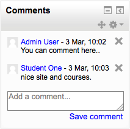
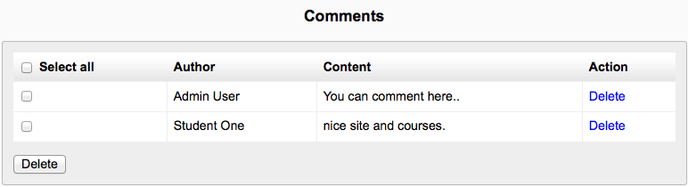
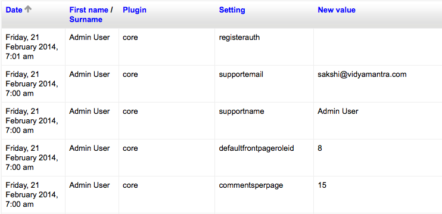
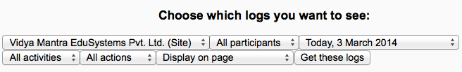
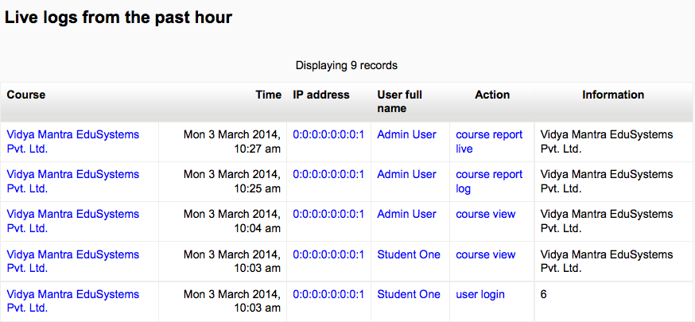
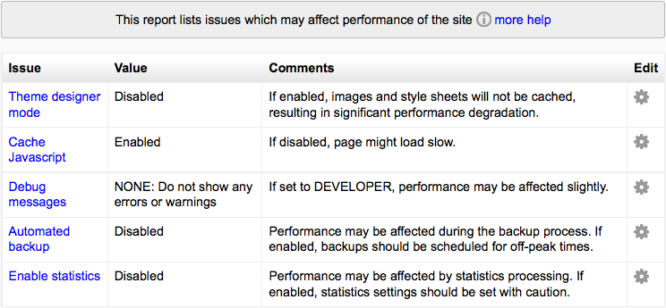
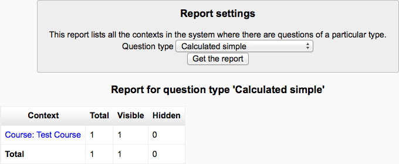

Reports
========

Comments
----------
A comments block can be added to any page in Moodle, enabling users to easily add comments. A similar interface enables comments to be added to glossary, database activity and blog entries. The comments interface uses AJAX so that comments are added instantly without needing a page refresh. 

Enabling comments
^^^^^^^^^^^^^^^^^^
Comments can be disabled/enabled by an administrator in *Settings > Site administration > Advanced features*. 

Blog comments
^^^^^^^^^^^^^^^
Blog comments are enabled by default. The feature may be disabled in *Site administration > Appearance > Blog*.

Comments report
^^^^^^^^^^^^^^^^
A list of all comments added may be found in *Site administration > Reports > Comments*. 

Backups
--------
A last execution log of scheduled course backups can be found in *Settings > Site administration > Reports > Backups*. It displays a list of all course backups made, the time taken to create them, their status (see below), and the next scheduled automated backup execution time.

Clicking on a particular course name will cause a detailed execution log to be displayed, including date, hour and minute when each step of the backup was performed. 

Config Changes
----------------
The config changes report enables an Administrator to see at a glance which aspects of the Moodle site have been recently altered and, where applicable, by which administrator.

The report is found in *Settings > Site Administration > Reports > Config changes* 

Logs
-----
Logs in Moodle are activity reports. Logs are available at site and course level. 

To obtain course overview reports, you must first enable statistics. If you haven’t got statistics enabled you will be taken to the enable statistics settings. You can choose to view reports of the most active courses or the most participatory courses over a certain time period. Results are displayed in a bar chart and in a table.

Live Logs
-----------
Live logs from the past hour (either for a course or for the site) are available via a link on the logs page. This allows you to define a number of parameters to run a report on activities within the system.

Live logs provide the following fields:

   * Course - course short name
   * Time - time of access
   * IP Address - unique user internet address
   * Full Name - name logged on with
   * Action - what they were doing
   * Information - any further information on the activity

Performance Overview
----------------------
The performance overview report in Administration > Site administration > Reports > Performance overview lists issues which may affect performance of the site. 

Question Instances
-------------------
An administrator can generate a question instances report in *Administration > Site administration > Reports > Question instances*. The Manager can also generate this report.

This report lists all the places a specific question type is used. It provides a list by course that shows the total, visible and hidden number of that question type. Clicking on a context link such as course title will take you to the relevant question in the question bank.

One practical use of this report is to find questions that may have inadvertently been created in a course which should have been created at the System default or a particular category context. 

Security Overview
-------------------
A security overview report is available for site administrators in *Settings > Site administration > Reports > Security overview*. 

This provides the site administrator with a report that highlights any security problems that need to be remedied.

    **Register globals** - register_globals is a PHP setting that must be disabled for Moodle to operate safely. 

    **Insecure dataroot** - The dataroot is the directory where Moodle stores user files. It should not be directly accessible via the web. 

    **Displaying of PHP errors** - If PHP is set to display errors, then anyone can enter a faulty URL causing PHP to give up valuable information about directory structures and so on. 

    **No authentication** - Use of the "no authentication" plugin can be dangerous, allowing people to access the site without authenticating. 

    **Allow EMBED and OBJECT** - Allowing ordinary users to embed Flash and other media in their texts (eg forum posts) can be a problem because those rich media objects can be used to steal admin or teacher access, even if the media object is on another server. 

    **Enabled .swf media filter** - Even the flash media filter can be abused to include malicious flash files. 

    **Open user profiles** - User profiles should not be open to the web without authentication, both for privacy reasons and because spammers then have a platform to publish spam on your site. 

    **Open to Google** - Allowing Google to enter your site means that all the contents become available to the world. Don't use this unless it's a really public site. 

    **Password policy** - Using a password policy will force your users to use stronger passwords that are less susceptible to being cracked by a intruder. 

    **Password salt** - Setting a password salt greatly reduces the risk of password theft. 

    **Email change confirmation** - You should generally always force users to confirm email address changes via an extra step where a confirmation link is sent to the user. 

    **Writable config.php** - The config.php file must not be writeable by the web server process. If it is, then it is possible for another vulnerability to allow attackers to rewrite the Moodle code and display whatever they want. 

    **XSS trusted users** - Make sure that you trust all the people on this list: they are the ones with permissions to potentially write XSS exploits in forums etc. 

    **Administrators** - Review your administrator accounts and make sure you only have what you need. 

    **Backup of user data** - Make sure that only roles that need to backup user data can do so and that all users who have the capability are trusted. 

    **Default role for all users** - This checks that the registered user role is defined with sane permissions. 

    **Guest role** - This checks that the guest role is defined with sane permissions. 

    **Frontpage role** - This checks that the frontpage user role is defined with sane permissions. 

Spam Cleaner
---------------
If your site was open in the past and you have a spam problem then here are some things you can do to clean up the profiles:

    1. Use our Spam cleaner report in *Settings > Site administration > Reports > Spam cleaner* to locate user accounts responsible for spam and other nasty stuff and help you delete them. In addition to user profile descriptions, comments, blog posts and messages are also searched for keywords.
    2. Browse your user list looking for patterns to detect users who need to be deleted. For example, spammers might have chosen a country that none of your real users has.
    3. Use the delete buttons or the Bulk user actions tool in *Settings > Site administration > Users > Accounts* to find all these users and delete them. 

