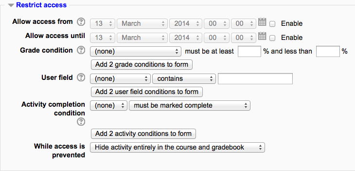

.. _restrict_access_settings:

Restrict access settings
=========================
The Restrict access area becomes visible in Moodle activities and resource settings if :ref:`Conditional activities <conditional_activities_settings>` have been enabled. This allows the teacher to set open and closed dates, if desired. It also allows the teacher to restrict access according to grades, dates, user field information, and Grouping assignment.

