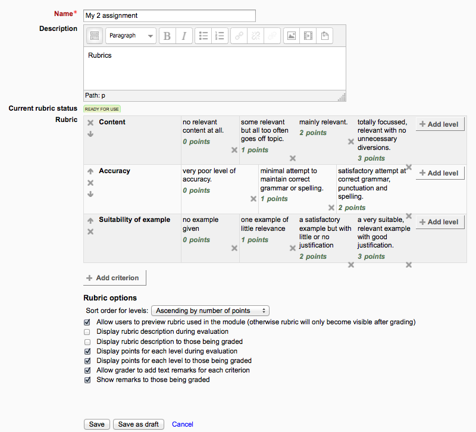
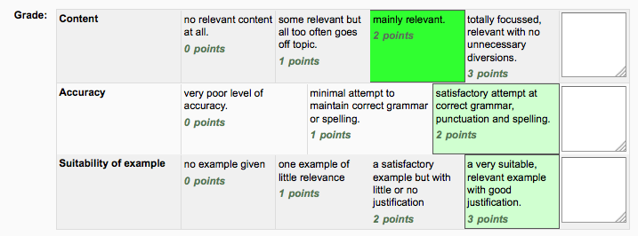
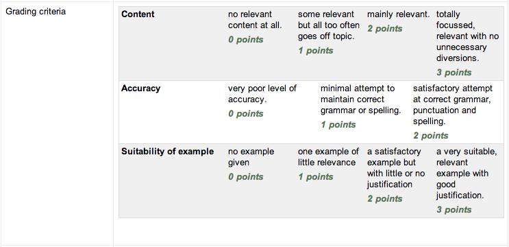

.. _rubric:

Rubric
=======
Rubrics are advanced grading forms used for criteria-based assessment. The rubric consists of a set of criteria. For each criterion, several descriptive levels are provided. A numerical grade is assigned to each of these levels. The rater chooses which level answers/describes the given criterion best. The raw rubric score is calculated as a sum of all criteria grades. The final grade is calculated by comparing the actual score with the worst/best possible score that could be received. 

Rubric editor
--------------
The rubric editor is available via the advanced grading method management screen which in turn is available via the 'Advanced grading' link in the activity settings block. The editor lets you set the rubric form name, the description and the rubric itself. The editor lets you add new criteria and levels, delete them and change the criteria order. There are several rubric options that can be configured, too. For each criterion, the criterion description should be filled. For each level, the level definition and the number of points associated with the level should be specified. Neither the criterion description nor the level definition text fields support embedded images yet.

The rubric definition must be saved using either 'Save rubric and make it ready' or 'Save as draft' button. The button sets the form definition status respectively as described at the Advanced grading methods page.

**Hint:** You can modify the effective weight of a criterion by setting the value of the points assigned to its levels. If there is one criterion with levels 0, 1, 2, 3 and the second one with levels 0, 2, 4, 6 then the later one's impact on the final grade is twice as much as the first one's.

**Hint:** Use the Tab key to jump to the next level/criteria and even to add new criteria. 

Using the rubric
------------------
When teachers use the rubric to assess some student's work, they select the level describing the student's performance best for each criterion. Currently selected levels are highlighted in light green. If the rubric filling is re-edited later, the previously selected level is highlighted in light red. A level must be selected for each criterion, otherwise the rubric is not validated by the server as the final grade can't be calculated.

If the form definition allows it, an optional remark can be filled for each criterion providing a detailed feedback/explanation of the assessment. 

How students access the rubric
--------------------------------

When students click on an assignment which has a rubric attached to it, they will see the rubric as part of the information about their assignment. Thus, they can see the rubric before they submit. 

