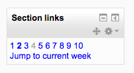

.. _section_links:

Section links
==============
The Section links block helps the student or teacher to quickly navigate to a particular topic/week section of the course (depending on whether the course uses either the "Topics" or "Weekly" format. The numbered links displayed within the block are the numbers assigned to the course topic/week sections.(Note that if a section is hidden, its number will display in grey for the teacher and not at all for the student, as with section 5 of the screenshot below.) 

Where a topic/week section is highlighted, the link to that section within the "Section Links" block is emboldened. In addition, a link for the highlighted section ("Jump to the current topic/week") is displayed. Click the "Jump to the current topic/week" link to display the highlighted section at the top of the screen.

If there are a large number of topic/week sections, the block displays every other even number i.e. 2, 4 etc. or every fifth numbered topic/week section. 

Site administration settings
------------------------------
*Administration > Site administration > Plugins > Blocks > Section links*

The section links block has some settings which may be changed by an administrator. There are two 'number of sections' value in the setting page, say numsections1 and numsections2.

If the number of sections in the course is less than either of them, the section links will increase by 1.

If the number of sections in the source is more than numsections1, but less than numsections2, the increase by value will respect numsections1's increase by setting.

If the number of sections in the source is more than both of numsections1 and numsections2, and numsections2 is more than numssections1, the increase by value will respect numsections2's increase by setting. 

