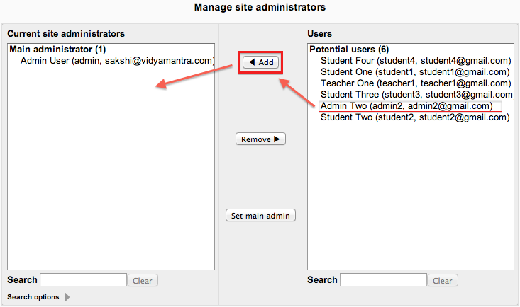

.. _site_administrators:

Site Administrators
====================
Site administrators have permissions to do anything.

Users may be assigned the role of site administrator by another site administrator in *Administration > Site administration > Users > Permissions > Site administrators*, but the role itself cannot be edited (or deleted!).

Note: The primary administrator (created when the site was created) cannot be removed from the site administrator role.
