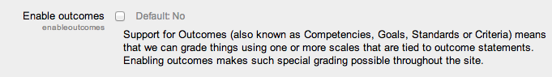

Site Setup
==========

This document will show you how to setup a moodle site.

Moodle Installation
-------------------
Moodle is primarily developed in Linus using Apache, PostgreSQL / MySQL / MariaDB and PHP .

Basic Requirements

Sever Hardware
^^^^^^^^^^^^^^^

Specific hardware requirements for your project will depend on the volume of anticipated concurrent users and should be discussed with your team IT team if you are hosting the server yourself, or company with whom you are hosting. As minimum are:

**Disk space :** 160MB free (min) plus as much as you need to store your material. 5GB is probably a realistic minimum.

**Memory :** 256MB (min) , 1GB or more is strongly recommended. Moodle can support 10 to 20 concurrent users for every 1GB of RAM

Server Software
^^^^^^^^^^^^^^^^

**Operating System :** A linux based system is recommended for high performance. Example- CentOS, Redhat, Ubuntu, Debian, Mac OS X . Moodle can also be installed on Window 7 / 2012

**Web server :**  Apache is recommended . Others also wok such as IIS, lighttpd, nginx, cherokee, zeus and LiteSpeed.

**PHP :** Minimum version is 5.3.3. recommended PHP 5.5 and newer if available.

**Database :** Minimum versions of following -

    * MySQL - version 5.1.33 (mostly recommended)
    * PostgreSQL - version 8.3 (mostly recommended)
    * MariaDB - version 5.3.5 ( drop-in replacement for Oracle's MySQL)
    * MSSQL- version 9.0 (fully supported but documentation and online help are not as comprehensive)
    * Oracle - version 10.2 (not recommended)

**Browser :** Mimimum browser for accessing Moodle: recent firefox, Internet Explorer 9, Safari 6, recent Gooogle Chrome 11 .

Set up your server
^^^^^^^^^^^^^^^^^^^

Depending on your particular choices of software set up your basic server . If you are using a hosted server all this should be done for you by your hosting provider.

Download and copy files into place
^^^^^^^^^^^^^^^^^^^^^^^^^^^^^^^^^^^

1. Download your required version from http://download.moodle.org/ and unzip it .
2. Then place the whole folder in your web server documents directory, in which case the site will be located at http://yourwebserver.com/moodle , or you can copy all the contents straight into the main web server documents directory, in which case the site will be simply http://yourwebserver.com .
3. Secure the Moodle files: it is vital that the files are not writeable by the web server user. Files are owned by administrator / superuser and are only writeable by them, readable by everyone else. If you want to use built-in ad-on installer you need to make the directory writeable by web server user.

Create an empty database
^^^^^^^^^^^^^^^^^^^^^^^^^

Create a new, empty database for your installation. You need to find and ake a note of following during information for final installation stage :

    * dbhost - the database server hostname. Probably ' localhost ' if the databse and web server are the same machine, otherwise the name of the database server.
    * dbname - the database name. Whatever you called it example - moodle .
    * dbuser - the username for the database.
    * dbpass - the passowrd for the above user

Create the data (moodledata) directory
^^^^^^^^^^^^^^^^^^^^^^^^^^^^^^^^^^^^^^^

Moodle requires a directory to store all of its files (all your site's uploaded files, temporary data, cache, session data etc.). The web server needs to be able to write to this directory. So create a directory and set the permissions for anyone on the server to write here. 

Start Moodle Install
^^^^^^^^^^^^^^^^^^^^^

1. Go to your Moodle's main URL using a web browser.
2. The installation process will take you through a number of pages. You should be asked to confirm the copyright, see the database tables being created, supply administrator account details and supply the site details. The database creation can take some time - please be patient. You should eventually end up at the Moodle front page with an invitation to create a new course.

Technical Specification
------------------------

Sever Hardware
^^^^^^^^^^^^^^^

Specific hardware requirements for your project will depend on the volume of anticipated concurrent users and should be discussed with your team IT team if you are hosting the server yourself, or company with whom you are hosting. As minimum are:

**Disk space :** 160MB free (min) plus as much as you need to store your material. 5GB is probably a realistic minimum.

**Memory :** 256MB (min) , 1GB or more is strongly recommended. Moodle can support 10 to 20 concurrent users for every 1GB of RAM

Server Software
^^^^^^^^^^^^^^^^

**Operating System :** A linux based system is recommended for high performance. Example- CentOS, Redhat, Ubuntu, Debian, Mac OS X . Moodle can also be installed on Window 7 / 2012

**Web server :**  Apache is recommended . Others also wok such as IIS, lighttpd, nginx, cherokee, zeus and LiteSpeed.

**PHP :** Minimum version is 5.3.3. recommended PHP 5.5 and newer if available.

**Database :** Minimum versions of following -

    * MySQL - version 5.1.33 (mostly recommended)
    * PostgreSQL - version 8.3 (mostly recommended)
    * MariaDB - version 5.3.5 ( drop-in replacement for Oracle's MySQL)
    * MSSQL- version 9.0 (fully supported but documentation and online help are not as comprehensive)
    * Oracle - version 10.2 (not recommended)

**Browser :** Mimimum browser for accessing Moodle: recent firefox, Internet Explorer 9, Safari 6, recent Gooogle Chrome 11 .

Managing a Moodle Site
-----------------------

A user with the role of Administrator is typically in charge of a Moodle site once it has been installed, although some tasks may be delegated to others by assigning them a role such as Manager. The links below provide more information about how to manage your Moodle site.

    * Authentication - different methods of adding new users to your Moodle
    * Managing accounts - how to search for, edit, delete or perform bulk actions on users
    * Enrolments - different methods of adding users to courses.
    * Roles and permissions - how to add or remove permissions from students, teachers and other users on your Moodle
    * Security - how to keep your Moodle safe
    * Performance - ways to check the efficiency and smooth running of your Moodle
    * Backup - how to backup your site and courses
    * Site appearance - ways to change the display and navigation of your site
    * Language - how to add new languages and alter the default terms used.
    * Server settings - registration, maintenance and default settings
    * Site-wide reports - a list of useful reports for administrators
    * Admin tools - a list of useful tools, such as DB search and replace and database transfer
    * Developer tools - how to debug your site, purge caches and tools for test sites only
    * Web services - how to connect other systems to Moodle to perform operations
    * Community hubs - search for, download, enrol in or add your own courses to public directories.
    * More features - Blogs, Comments, Tags, Messaging, Notes, RSS feeds, Calendar

Advanced Features
------------------

The advanced features in Administration > Site administration > Advanced features contains a number of features that may be enabled / disabled globally by the site administrator.

**Outcomes**

Outcomes are specific descriptions of what a student has demonstrated and understood at the completion of an activity or course. Each outcome is rated by some sort of scale. Other terms for outcomes are Competencies and Goals.

They are similar to sub components of a grade. A grade is an assessment of overall performance that may include tests, participation, attendance and projects. Outcomes assess specific levels of knowledge through a series of statements, that maybe coded with numbers or letters. Thus an overall grade can be given for a course, along with statements about specific competencies in the form of outcomes.

**Comments**

A comments block can be added to any page in Moodle, enabling users to easily add comments. A similar interface enables comments to be added to glossary, database activity and blog entries. The comments interface uses AJAX so that comments are added instantly without needing a page refresh.

**Tags Functionality**

Tags allows students and teachers to describe their interests in a way that is easy for people with similar interests to find them. The user's profile has a place to enter interests, which will create or add the user to an existing tag. Tag pages can be viewed and blog posts can be tagged.

**Notes**

The Notes feature is a way to attach information about a user by another user. For example, a teacher might attach a note to a specific student about the hobbies and interests that seems to engage that student.

Users must have the permissions to View notes and Manage notes in order to use this feature in any context. Thus students might be allowed to view or even manage notes within a course.

**Portfolios**

Portfolios in Moodle make it easy for a student to export their work to an external portfolio. For example, student work might include forum posts or assignment submissions that they believe demonstrates their knowledge.

**Web Services**

Web services enable other systems to login to Moodle and perform operations.

**Messaging**

Messaging refers both to automatic alerts from Moodle about new forum posts, assignment submission notifications etc, and also to conversations using the instant messaging feature.

**Notification email override**

For allowing users to enter a different email address in Administration > My profile > Messaging .

**Statistics**

If statistics are enabled for the site, graphs and tables of user activity may be generated.

**RSS feeds**

RSS (really simple syndication) feeds in Moodle enable people to stay up to date with forum posts, glossary entries and other events within Moodle.

**Blogs**

Blogs in Moodle are user based - each user has their own blog. Users can also register their external blogs, such as Blogger or Wordpress, so that entries are automatically included in their Moodle blog.

**Networking**

The Moodle network feature allows a Moodle administrator to establish a link with another Moodle or a Mahara site and to share some resources with the users of that Moodle.

**Completion tracking**

Completion tracking is a process that assists Course completion and Activity completion features. It must be enabled in Advanced settings before it can be used anywhere in the site.

**Conditional access**

Conditional activities enable teachers to restrict the availability of any activity or even a course section (in Moodle 2.3 onwards) according to certain conditions such as dates, grade obtained, or activity completion. When it is enabled by the administrator, a "Restrict access" setting appears in the settings of activities or resources .

**Plagiarism plugins**

Plagiarism is when a student submits content they have copied and the real author was not given credit for the words. Plagiarism prevention detects when this form of cheating or academic dishonesty has happened.

**Badges**

Badges are a good way of celebrating achievement and showing progress. Badges may be awarded based on a variety of chosen criteria and are fully compatible with Mozilla Open Badges. They are displayed on a user's profile.

