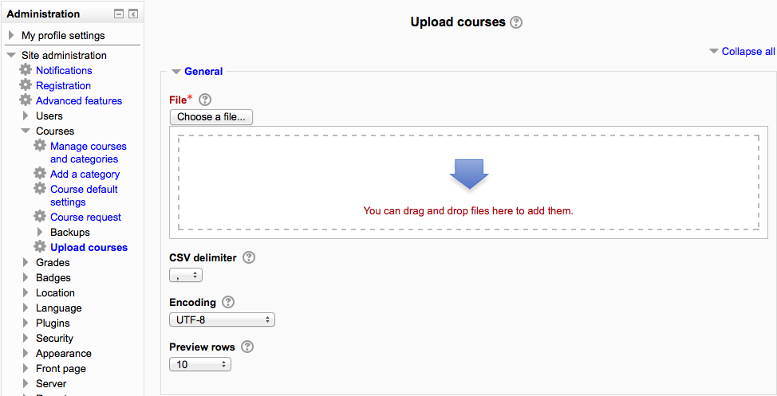

.. _upload_courses:

Upload courses
===============
To upload one or more courses

    1. Go to *Administration > Site administration > Courses > Upload courses*
    2. Either drag and drop the CSV file or click the 'Choose a file' button and select the file in the file picker
    3. Select appropriate import options carefully, then click the preview button. 

  
**Note:** It is also possible to use the command-line tool *admin/tool/uploadcourse/cli/uploadcourse.php*.

When using the web interface, use the Preview option to see if any errors were detected in the previewed rows. If you proceed with the upload and there were something wrong detected with a course, it will be ignored. 

**Example:** 
uploadcourse.csv :

.. list-table:: Cohort
   :widths: 20 20 20 20 20 20 20
   :header-rows: 1

   * - shortname
     - fullname
     - category
     - summary
     - enrolment_1
     - enrolment_1_role
     - enrolment_1_enrolperiod
   * - courserestored
     - Course restored
     - 1
     - a summary
     - manual
     - student
     - 1 month
   * - courserestored
     - Course restored 2
     - 1
     - a summary
     -
     -
     -
   * - courserestored
     - Course restored 3
     - 1
     - a summary
     -
     -
     -

Creating the text file
-----------------------
The text file to upload courses must be a CSV file. It accepts the following columns which are divided in two categories, the course information, and the course actions. 

Course information fields
^^^^^^^^^^^^^^^^^^^^^^^^^^

   * shortname - the shortname 
   * fullname - the full name 
   * idnumber - the ID number 
   * category - the ID of the category to place the course in. This takes precedence over category_idnumber and category_path. 
   * category_idnumber - the ID number of the category to place the course in. This takes precedence over category_path. 
   * category_path - the path of the category to place the course in.
   * visible - 1 if the course is visible, 0 if hidden 
   * startdate - the time at which the course starts. Please note that this value is passed to the PHP function strtotime to generate a timestamp. 
   * summary - the summary of the course 
   * format - the course format to use, this must be a valid course format plugin name. E.g. weeks, topics. 
   * theme - the theme to use 
   * lang - the language to use 
   * newsitems - the number of news items 
   * showgrades - 1 to show the gradebook to students, 0 to hide it. 
   * showreports - 1 to show the activity reports, 0 to hide it. 
   * legacyfiles - 1 to enable the legacy course files, 0 not to. 
   * maxbytes - the maximum upload size of the course in bytes. Use 0 for the site limit. 
   * groupmode - 0 for No groups, 1 for Separate groups and 2 for Visible groups. 
   * groupmodeforce - 1 to force the group mode, otherwise enter 0. 
   * enablecompletion - 1 to enable the activity completion, 0 not to. 
   
Enrolment fields
^^^^^^^^^^^^^^^^^

Some fields can be constructed to enable and configure enrolment methods. The fields must be named enrolment_[number] for the enrolment method name, and enrolment_[number]_property for its properties.

   * enrolment_[number] - The name of the enrolment method 
   * enrolment_[number]_delete - 1 to delete this enrolment method from the course, if set to 1 all the other properties will be ignored. 
   * enrolment_[number]_disable - 1 to disable this enrolment method from the course, if set to 1 all the other properties will be ignored. 
   * enrolment_[number]_startdate - The enrolment start date. This value is passed to the PHP function strtotime(). 
   * enrolment_[number]_enddate - The enrolment end date. This value is passed to the PHP function strtotime(). 
   * enrolment_[number]_enrolperiod - Number of seconds, or if not a value understood by strtotime() such as "4 days". 
   * enrolment_[number]_role - The role short name 
   * enrolment_[number]_[property] - Where property is understood by the specified enrolment method 
   * role_[shortname] - The new name of the role [shortname]. 
   
**Note:** Upload courses is not yet compatible with all enrolment methods

Course action fields
^^^^^^^^^^^^^^^^^^^^^

Those settings take precedence over the Course process parameters.

   * delete - 1 to delete the course 
   * rename - The shortname to rename the course to 
   * backupfile - An absolute path to a backup file (.mbz) to import in the course 
   * templatecourse - The short name of a course to import the content from 
   * reset - 1 to reset the course 

Mandatory fields
^^^^^^^^^^^^^^^^^

   * shortname - This field is mandatory for every operation, with the only exception of creating new courses. See details on the course process parameter Shortname template for more information. 
   * fullname - Required when creating a new course. 
   * category, category_idnumber, category_path - One of these is required when creating a course. 

Import options
^^^^^^^^^^^^^^^

To prevent unexpected behaviour, you have to specify what you want the tool to be able to do.

   * Upload mode - This allows you to specify if courses can be created and/or updated. 
   * Update mode - If you allow courses to be updated, you also have to tell the tool what to update the courses with. 
   * Allow deletes - Whether the delete field is accepted or not 
   * Allow renames - Whether the rename field is accepted or not 
   * Allow resets - Whether the reset field is accepted or not 

Course process
^^^^^^^^^^^^^^^

This allows you to specify actions to be taken for every course uploaded.

   * Shortname template - If you are creating courses without a shortname, you can use this field to automatically generate a shortname. This field accepts two placeholders: %i for the ID number, %f for the summary. 
   * Restore file - A backup file (.mbz) to import in the course after create/update. 
   * Restore from course - The shortname of a course to import content from after create/update. 
   * Reset after upload - Whether to reset the course after creating/updating it. 

