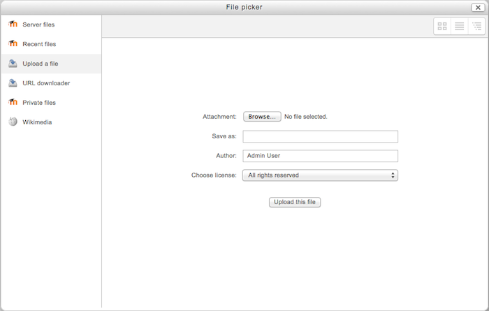

.. _upload_file:

Upload file
============
The Upload a file repository enables users to browse and upload files from their computer into Moodle. Recently uploaded files may be accessed by clicking on the recent files link in the file picker. 

Repository capabilities
-------------------------
There is just one capability, Use uploading in file picker, which is allowed for the default authenticated user role. 

