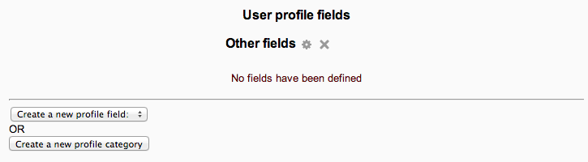

.. _user_profile_fields:

User profile fields
====================

Administrators can create new user profile categories and fields in Administration > Site administration > Users > Accounts > User profile fields.

Profile fields may be a menu of choices, text area, text input or a checkbox and may be required or not.

New profile fields will appear on each user’s profile page unless "Who is this field visible to?" is set to "Not visible" in which case only the administrator can see the field. The fields can also be displayed on the signup page if "Display on signup page?" is set to "Yes" (although note that they will never be displayed if set to "Not visible").

You can set the order in which your custom profile fields appear under the associated profile category using the up/down arrows on the User profiles fields page.

To create a new profile field, select the profile field format you require from the dropdown list.

Common Settings
^^^^^^^^^^^^^^^^

All new fields must be given a unique Short Name and a Name (this is displayed on the profile page). You may also choose to enter a Description for the field for your own reference. There are also a number of configuration options common to all custom profile field types:

**Is this field required?**
This option specifies whether this is a mandatory or optional field for user accounts.

**Is this field locked?**
This option determines whether once information is populated in this field, it cannot be edited by the user.

**Should the data be unique?**
If you need the information populated in your field to be unique across the system (such as an ID number) select Yes to this option and the  profile page update will perform a validation check on the data entered.

**Display on signup page?**
Depending on the authentication method in use on your Moodle site, you may have some users creating their own accounts. If you would like this custom field to appear on the registration or signup page, select Yes.

**Who is this field visible to?**
Each custom field can be given one of three visibility settings:

     * Visible to everyone
     * Not visible
     * Visible to user 

The Not visible setting would typically be set by an administrator who wants to hold private data on the users. The Visible to user setting would normally be selected for a field that holds sensitive information, while the Visible to everyone setting can be used for any type of information.

Specific Settings
^^^^^^^^^^^^^^^^^^

There are also a few field type Specific Settings requiring configuration around default value and size.

**Important**

If the site administrator bulk uploads user data via .csv file, it is essential to use the correct convention to represent the new profile field. The convention is profile_field_shortname

Replace 'shortname' with the actual short name used for the new profile field eg. dob. So the field should read something like profile_field_dob.

Also, you will need to visit Administration > Site Administration > Users > Accounts > User Profile Fields > Create new Profile Field before attempting to upload a file using it. Creating an upload file first with custom profile fields without creating the User Profile Fields first in Site Administration **will result in the error** .

