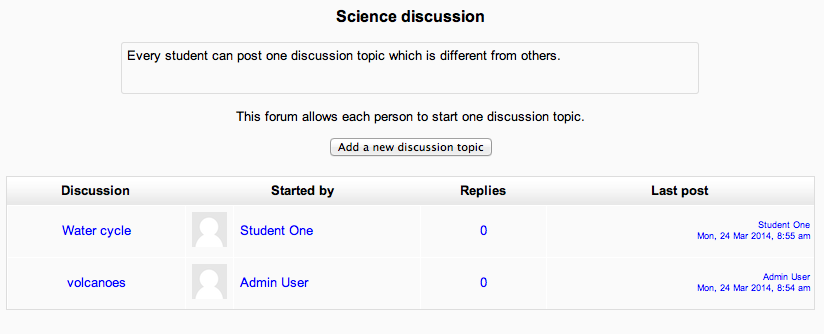
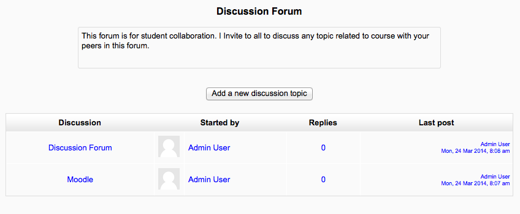
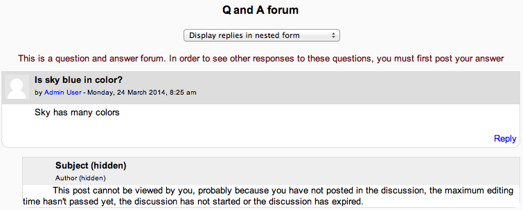
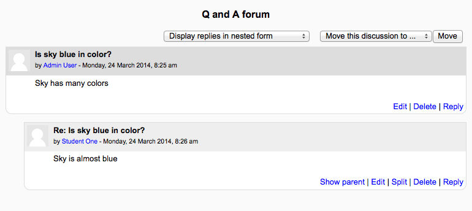

.. _using_forum:

Using Forum
============
The teacher can set the format of what the student sees under the introduction by selecting the forum type in Forum settings. 

Views
------

**A single simple discussion**

Students will see the text you have placed in the Forum introduction setting as the first post of the discussion. Below you will find the replies that have been posted. In the example below, the student sees that their reply was rated. 

**Each person posts one discussion**

The view will be basically the same as in the previous case, the only difference being the 'Add a new discussion' option. Viewing a forum page, the student will see the text you have written at the 'Forum introduction' space while creating the forum, and, if there are any, the discussions that have been started. 

**Standard forum for general use**

In this forum type, students will see the introduction text in a separate space above the discussion field, in which you will see the information such as the title of the discussion (which means the forum's title), its author, the number of replies and the date of the last post. 

**Question and Answer forum**

The Q & A forum is best used when you have a particular question that you wish to have answered. In a Q and A forum, teachers post the question and students respond with possible answers. By default a Q and A forum requires students to post once before viewing other students' postings.

**Standard forum displayed in blog-like format**
 
In the upper right corner of the home forum screen (above the introduction), the student may see the options the teacher has set for subscriptions to the forum, and the 'Jump to' field, with which you can 'jump' to any part of the course. This is also place where the teacher will find the "Update this forum" button.

Display options
-----------------
A discussion thread may be displayed in four ways. Use the pull down menu at the top of each forum discussion to select a display type.

  * Display replies flat, with oldest first
  
      .. image:: _images/forum14.png
  
  * Display replies flat, with newest first - The discussion will be displayed in one line and the chronological order from the newest to the oldest. This is the same as the above, just a different sort order.
  * Display replies in threaded form - Only the post starting the discussion will be displayed in its full form; replies will be reduced to the headlines (including information about its author and date of release) and organized chronologically; moreover, replies will be shifted towards the right so that only replies to the same post were in the same line.
 
      .. image:: _images/forum15.png
 
  * Display replies in nested form - All posts are displayed in their full forms; replies will be reduced to the headlines (including information about its author and date of release) and organized chronologically; moreover, replies will be shifted towards the right so that only replies to the same post were in the same line. 
    
      .. image:: _images/forum16.png
      
Forum posting
--------------
The default content of Subject is usually 'Re: <the name of the 'parent' post>'. You can change it though.

When writing text in Moodle there are several formats you can choose to produce your text, depending on your expertise and the type of browser you are using. Please refer to Formatting text for further information.

**Sharing images through forums**

  * When an image is "attached" as a file to a forum message, it is immediately displayed full size after the message (i.e. no need to click on an attachment). This an excellent way of sharing images without having to go through the process of uploading them as files and linking them from within web pages. 
  * Images may be dragged and dropped into the box as well as uploading via the "add" link and the :ref:`File picker <file_picker>`. 
  
**Sharing sound and video through forums**

  * If multimedia filters are enabled, a sound file (mp3) or accepted video file can be attached and it will be embedded into the forum post in an appropriate player.
  * As with images in the previous section, multimedia files may be dragged and dropped from the desktop instead of uploaded via the File picker.   
  
**Post length**

Extra-long posts cause problems when doing a forum search and can be difficult to read on screen. Rather than creating a very long post, consider copying and pasting the text into a text file and add it as an attachment to your forum post.

**Post editing time limit**

There is a time limit for editing posts, usually 30 minutes. It is set by an administrator in Administration > Security > Site policies.

The Using Moodle forum discussion The philosophy underlying "no editing after 30 minutes" includes reasons why it is a good idea to have a time limit for editing posts.   
  
**Mail now**

A mail now checkbox is available for anyone with the capability to manage course activities, normally teachers and admins.

Checking the "Mail now" box results in a notification being sent immediately (i.e. when the cron next runs) to everyone subscribed to the forum, rather than after the post editing time limit.

**Note:** For users who have enabled email digests in their profile, the notification is NOT sent separately from other forum post notifications.   
  
Exporting forum posts
----------------------
Users with the *mod/forum:exportdiscussion* or *mod/forum:exportownpost* or *mod/forum:exportpost* permission can export forum posts to any portfolio the administrator has enabled 
  
Moving a discussion
--------------------
Teachers and other users with the capability to move discussions can move a discussion to any other forum in the course for which they have appropriate rights.

  * Click on the arrow in the 'Move this discussion to...' dropdown menu in the top right corner of the page and select a destination forum.
  * Click the Move button. 

**NOTE:** Moving a forum post will display incorrect results in the course participation report for the affected forums. For example, take a student who posted in forum A and had their post moved to forum B. In the course participation report the student will still be listed has having made a post in forum A, but will not be listed as having made a post yet in forum B. 
  
Forum subscription
-------------------
When a person is subscribed to a forum it means that they will be notified (according to their :ref:`Messaging settings <message_settings>` preferences) of every subsequent post in that forum. Posters have 30 minutes by default to edit their post before it is sent though this time limit can be changed by an administrator.

People can usually choose whether or not they want to be subscribed to each forum. However, if a teacher forces subscription on a particular forum then this choice is taken away and everyone in the class will get notified.This is especially useful in the News forum and in forums towards the beginning of the course (before everyone has worked out that they can subscribe to these emails themselves).

Note that even if you force subscriptions every user can elect not to be notified in :ref:`Messaging settings <message_settings>`, or elect to have all email sent once a day in a digest contain either all posts or simply the subject headings.

Choosing *Everyone* can choose to be *subscribed* enables you to check (and modify) the number of subscribers (*Administration > Forum administration > Show/edit current subscribers*) and to subscribe to (or unsubscribe from) the forum ('Subscribe to this forum' / 'Unsubscribe from this forum'). 

Forum suggestions to consider
------------------------------
  1. If your course is at a distance, if your face to face time is limited, or if you just wish to foster a sense of community in your Moodle course which supplements your face to face course, it is good practice to begin with a welcome or introductory message or thread in one of your forums. This welcome or introduction from you invites participants, for example, to post some specific details to introduce themselves to you and their peers. This can be your icebreaker or you can have an icebreaker separately.
  2. If you have two questions for participants to answer, starting the two strands or topics within the forum itself will both help learners to see where to put their responses, and remind them to answer all parts of your question.
  3. Remember that you are communicating in an environment that does not have the benefit of verbal tone, eye contact, body language and the like. Careful consideration of your communication is, therefore, necessary.
  4. Postings to a forum are always written but they can take different forms and you may wish to consider what form best suits the activity. For instance, you might choose to articulate a form of contribution in order to be explicit. Thus you might say, 'This is a think-aloud forum in which, together, we will try to tease out ideas and possibilities' or 'This is a formal forum in which you are invited to share your ideas on (topic)' and, where you select the latter, you might have already suggested learners plan those ideas offline or in another kind of activity within Moodle.
  5. Create a forum where only the teacher can start discussions, but the students can only reply. Each thread you start contains an essay question (or several similar ones). The students make a bullet point plan for the essay and post it as a reply. This works well as a revision strategy as the students can see how others have approached the same task. Once everyone has posted their plan, you can start a discussion as to which plans seem better and why. Creating a scale to use for rating the posts can be useful so that the students can see how helpful other people think their effort were. (Note: At this time, there is no option to hide the "Add new discussion topic" button, so you need to tell your students not to start discussion threads, but to only reply to threads started by the teacher. If you only need one thread, then you can use the "a single simple discussion" format and the "Add new discussion topic" button is not available to the students.) 
  
**Grading forums**
The teacher can use the ratings scales to grade student activities in a forum. There are several methods for calculating the grade for a forum that can be found in the Forum settings under grades. There are 5 ways to aggregate ratings automatically to calculate a forum grade for the Gradebook. These include: Average, Max, Min, Count and Sum.

Forum ratings allow users to evaluate posts in a forum  
-------------------------------------------------------  
Forum ratings use Scales to standardize the reporting of performance. A forum rating can be included as part of a student's grade. For example, a teacher might use a custom rating scale in a forum and allow students to rate forum posts.

Forum ratings must be allowed and the potential rater must have role permission. Teachers by default have this ability. The teacher role is also able to give permission to a student role in a specific forum to be able to assign a rating to a post. 

**How to use**
When rating is allowed, the qualified user will see "Rate this post" and a pull down menu after an entry (not their own). The menu displays a scale that the forum creator selected in the Forum grade settings. The user can rate more than one post at a time. When finished they should click the "submit my ratings" button at the bottom of the page. 

AJAX forum rating
^^^^^^^^^^^^^^^^^^
Forum rating can be made more user-friendly with the use of AJAX. Users can rate forum posts almost instantly without needing to scroll to the bottom of the page and click the "Send in my latest ratings" button.

AJAX forum rating requires AJAX to be enabled by an administrator in *Administration > Site administration > Appearance > AJAX and Javascript* and by users in their user profile. 
  
  
  
