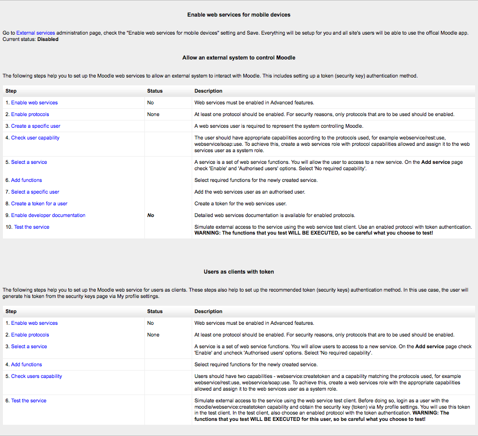

.. _using_web_services:

Web services
=============
Web services enable other systems to login to Moodle and perform operations. 

Enabling web services
-----------------------
    1. Access *Administration > Site administration > Advanced features*
    2. Check 'Enable web services' then click 'Save Changes' 

**Note:** For security reasons, web services should only be enabled if you intend to make use of it. 

.. _manage_protocols:

Manage protocols
-----------------

Enabling protocols
^^^^^^^^^^^^^^^^^^^^
Usually external applications that users wish to use dictate which protocols should be enabled.

    1. Access *Administration > Site administration > Plugins > Web services > Manage protocols*
    2. Enable the protocols (SOAP, REST, XMLRPC, AMF, ...) as required 

Enabling web service function documentation
^^^^^^^^^^^^^^^^^^^^^^^^^^^^^^^^^^^^^^^^^^^^^
Enabling web service function documentation (also on the Manage protocols page) results in user-specific web service documentation being available for each user on their Security keys page. This option is mainly useful to web service client developers. If nobody is creating a web service client, there is no need to enable this feature.

.. _external_services:

External services
-------------------

Creating a service
^^^^^^^^^^^^^^^^^^^^
If none of the pre-build web services match your needs, you can create a custom service i.e. select which of the standard web service functions are available via that service.

You can enable only the specific functions that you need to expose, so not compromising on security. 
     
    1. Access *Administration > Site administration > Plugins > Web services > External services*
    2. Click Add new custom service
        * 'Authorised users only' - If enabled, you will need to select the authorised users manually. Otherwise all users with appropriate permissions are allowed
        * 'Required capability' - If enabled, any user accessing the web service will be checked against this selected capability. (This is just an additional optional security layer.) 
    3. Enter a name and check Enabled
    4. Click the button 'Add service' 

    
Adding functions to the service
^^^^^^^^^^^^^^^^^^^^^^^^^^^^^^^^^
Your service is currently empty and doesn't do anything. Web service functions need to be added. Your choice will be dictated by what you allow the external application to do. For this example, select 'Create group'.

    1. Click 'Add functions' link
    2. Select 'create group' function and click the 'Add functions' button 

You should be back to the service functions list. 'Required capabilities' are indicated for each function. Users need the required capabilities to run a function. The function descriptions in the API Documentation can also give you more information about the required capabilities (*Settings > Site administration > Plugins > Web services > API Documentation*). 
    

Enabling capabilities
^^^^^^^^^^^^^^^^^^^^^^^
The final step is to grant appropriate permissions. The following capabilities should be allowed:

    * moodle/webservice:createtoken - for allowing users to generate a security key
    * webservice/rest:use, webservice/soap:use, webservice/xmlrpc:use, webservice/amf:use which match the enabled protocols.
    * The service Required capability if set (*Administration > Site administration > Plugins > Web services > Manage services > Edit link*).
    * The required capabilities for the web service functions. These required capabilities are listed when you add a function to the service. For more information about roles and capabilities, read the Manage roles documentation. 

Once done, the web service should be set up. Users should be able to obtain a personal security key. 

Alternate settings
^^^^^^^^^^^^^^^^^^^^

Authorise only specific users
^^^^^^^^^^^^^^^^^^^^^^^^^^^^^^^
    1. *Administration > Site Administration > Plugins > Web services > External Services*
    2. Select Authorised users link (the service must have been set as Authorised users only in the Edit link)
    3. Select some users and click Add 

Moodle indicates if some capabilities need to be assigned to an authorised user. Moreover if you click on the authorised user fullname, you can set up some specific options: IP restriction and Valid until. 

.. _manage_tokens:

Manage tokens
---------------

This feature allows you to create a token for specific user. It can be useful if a user doesn't have the moodle/create:token capability. This is also the only way to create a token for an administrator. For security reason, tokens are not automatically generated in the administrator security keys page.

    1. *Administration > Site Administration > Plugins > Web services > Manage tokens*
    2. Click on Add
    3. Select the created user and service
    4. Click on Saves changes 

As you created a token for this user, you do not need to assign "moodle/webservice:createtoken" to him/her. Finally, note that, as for authorised users, you can also set IP restriction and Valid until on a token. 

.. _overview:

Overview
---------
Overview link in *Administration > Site administration > Plugins > Web services > Overview* show details and status of web services.

