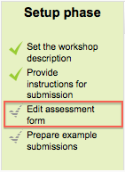

.. _workshop:

Workshop
=========
Workshop is a peer assessment activity with many options. Students submit their work via an online text tool and attachments. There are two grades for a student: their own work and their peer assessments of other students' work. 

Features
---------
Workshop is similar to the Assignment module and extends its functionality in many ways. However, it is recommended that both course facilitator (teacher) and course participants (students) have at least some experience with the Assignment module before the Workshop is used in the course.

  * As in the Assignment, course participants submit their work during the Workshop activity. Every course participant submits their own work. The submission may consist of a text and attachments. Therefore, Workshop submission merges both Online text and Upload file types of the Assignment module. Support for team work (in the sense of one submission per group of participants) is out of scope of Workshop module.
  * The submissions are assessed using a structured assessment form defined by the course facilitator (teacher). Workshop supports several types of assessment forms. All of them allows multi-criteria assessment in comparison to the Assignment module where only one grade is given to a submission.
  * Workshop supports peer assessment process. Course participants may be asked to assess selected set of their peers' submissions. The module coordinates the collection and distribution of these assessments.
  * Course participants get actually two grades in a single Workshop activity - grade for their submission (that is how good their submitted work is) and grade for assessment (that is how well they assessed their peers). Workshop activity creates two grade items in the course Gradebook and they can be aggregated there as needed.
  * The process of peer assessment and understanding the assessment form can be practised in advance on so called example submissions. These examples are provided by the facilitator together with a reference assessment. Workshop participants can assess these examples and compare their assessment with the reference one.
  * The course facilitator can select some submissions and publish them so they are available to the others at the end of Workshop activity (in comparison to the Assignment module where submitted work is available only to the author and the facilitator). 

Adding a new workshop
----------------------
With the editing turned on, in the section you wish to add your workshop, click the "Add an activity or resource" link (or, if not present, the "Add an activity" drop down menu ) and choose *Workshop*. All settings may expanded by clicking the "Expand all" link top right. 

General
^^^^^^^^

**Name**

Whatever you type here will form the link learners click on to view the workshop, so it is helpful to give it a name that suggests its purpose.

**Description**

Add a description of your workshop here. Click "Show editing tools" to display the rich text editor, and drag the bottom right of the text box out to expand it.

**Display description on the course page**

If this box is ticked, the description will appear on the course page just below the name of the workshop. 

Grade settings
---------------
(These settings are collapsed by default) 

.. image:: _images/workshop_3.png

**Grading Strategy**

What you choose here determines the assessment form students will use and also the strategy for grading submissions.

**Note:** Grading strategies can't be changed once we have entered the submission phase of a workshop

  * **Accumulative grading**: Comments and a grade are given regarding the aspects of the workshop specified. 

  * **Comments**: Comments are given but no grade can be given to the specified aspects 

  * **Number of Errors**: A yes/no assessment is used and comments are given for specified assertions 

  * **Rubric**: A level assessment is given regarding specified criteria 

**Grade for Submission**

This sets the maximum grade a student can attain from a teacher for a given submission. It is scaled between 0-100

**Grade for Assessment**

Sets the maximum grade a student can receive for assessing other students’ work. It is also scaled between 0-100

**Decimal places in grade**

Decide here how many decimal places are allowed in the grade. 

Submission settings
^^^^^^^^^^^^^^^^^^^^
(These settings are collapsed by default) 

**Instructions for submission**

Explain here what students must submit.

**Maximum number of submission attachments**

If you wish students to attach files, select how many here, up to a maximum of 7. If you leave it at 0 then they can only enter text.

**Maximum File Size**

Decide here how large a file students can upload. The size will depend on the course upload limit.

**Late Submissions**

Ticking this box will allow students to submit after the deadline. 

Once the workshop has been made we can then set more settings relating to submissions. This is done through clicking on the menu highlighted below which is found when you click on the workshop’s link or after clicking “Save and Display” on completion of the workshop. To access the menu simply click on “Allocate Submissions”. It is highlighted in the picture by the red box. See the section :ref:`Submission phase <submission_phase>`. 

Assessment settings
^^^^^^^^^^^^^^^^^^^^^
(These settings are collapsed by default.) 

Teachers can write instructions for assessments online. This is very useful to help students have a better understanding about the important points of a task before assessing their classmates’ submissions.

After the workshop has been made, teachers can set more settings related to assessments. See the section :ref:`Set up phase <set_up_phase>`. 

Feedback
^^^^^^^^^

**Overall feedback mode**

If this is enabled, a text box appears at the bottom of each assessment form for reviewers to give an overall comment about the submission. Depending on whether is it set to "Enabled and optional" or "Enabled and required", reviewers will either have the choice of leaving overall feedback or they will be forced to do so.

**Maximum number of overall feedback attachments**

Choose here how many (if any) files you wish reviewers to attach to their overall feedback, up to a maximum of 7.

**Maximum overall feedback attachment size**

Decide here how large a feedback file students can upload. The size will depend on the course upload limit.

**Conclusion**

It is possible to add some custom text which the students will see once they reach the end of the workshop process. This might be a general summary or suggestions on what should be done next, such as writing a blog post to reflect on the experience. 

Example submissions
^^^^^^^^^^^^^^^^^^^^
(These settings are collapsed by default.) 

There are three options in this drop down menu: The first option means that the assessment of the example submission is voluntary, while the second and the third ones make it mandatory, which either requires students to assess example submissions before submitting their own work or after their own submission but before peer-assessment.

**Note:** Assessments of the example submission are not counted when calculating the grade for assessment.

Availability
^^^^^^^^^^^^^
(These settings are collapsed by default.) 

.. image:: _images/workshop_9.png

his section deals with setting submission times and assessment times for the workshop. That is the time when students can start submitting as well as the deadline for submitting, and similarly the time assessments for other students’ work start and when they must finish assessing other students work.

All dates - open for submissions from, submissions deadline, open for assessment from and assessment deadline - are displayed in the course calendar. 

Common module settings
^^^^^^^^^^^^^^^^^^^^^^^
(These settings are collapsed by default.)

See :ref:`Common module settings <common_module_settings>`

Restrict access/Activity completion
^^^^^^^^^^^^^^^^^^^^^^^^^^^^^^^^^^^^^
(These settings are collapsed by default)

These settings are visible if :ref:`Conditional activities <conditional_activities_settings>` and :ref:`Activity completion <activity_completion_settings>` have been enabled in the site and the course.

.. _set_up_phase:

Set up phase
--------------

In order to set the criteria for an assignment, teachers need to fill out an assessment form during the setup phase. Students can view this assessment form in the submission phase and focus on what is important about the task when working on their assignment. In the next phase-the assessment phase, students will assess their peers’ work based on this assessment form.

According to the grading strategy chosen in the grading settings, teachers will get corresponding original assessment form to edit by clicking ‘Edit assessment form’ button in the first page of the workshop setup for the assignment. The grading strategy can be one of *Accumulative grading, Comments, Number of errors or Rubrics*. Teachers can set each criterion in detail in the assessment form.

.. _submission_phase:

Submission phase
------------------
Once the workshop has been made we can then set more settings relating to submissions. This is done through clicking on the menu highlighted below which is found when you click on the workshop’s link or after clicking “Save and Display” on completion of the workshop. To access the menu simply click on “Allocate Submissions”. It is highlighted in the picture by the red box. 

.. image:: _images/workshop_11.png
Submission settings for allocating reviewers to submissions

**Manual Allocation**

Manual allocation menu

Here,a teacher can manually choose which students review whose work. A student can review work even if they have not submitted anything themselves.

**Random Allocation**

.. image:: _images/workshop_13.png
Random allocation menu

The teacher is given 5 settings that determine how the random allocation will work.

  * **Number of reviews**: Here the teacher picks between 0 and 30 reviews for either each submission or per reviewer. That is the teacher may choose to either set the number of reviews each submission must have or the number of reviews each student has to carry out
  * **Prevent Reviews**: If the teacher wishes for students of the same group to never review each other’s work, as most likely it is their work too in a group submission, then they can check this box and moodle will ensure that they are only allocated other students out of their group’s work to access
  * **Remove current allocations**: Checking this box means that any manual allocations that have been set in the Manual Allocation menu will be removed
  * **Can access with no submission**: Having this box checked allows students to assess other students’ work without having already submitted their own work.
  * **Add self assessments**: This options when checked make sure that as well as assessing other students’ work they must also assess their own. This is a good option to teach students how to be objective to their own work. 

Assessment phase
------------------

**Examples:**

Students can assess example submissions for practice before assessing their peers' work if this feature is enabled. They can compare their assessments with reference assessments made by the teacher. The grade will not be counted in the grade for assessment.

Teachers need to upload one or more example submissions and the corresponding reference assessment to support this function.

Teachers can also edit the reference assessment later by clicking the ‘re-assess’ button in the first page.

**Peer assessment:**

If this feature is enabled, a student will be allocated a certain amount of submissions from his peers to assess. He will receive a grade for each assessment, which will be added together with the grade for his own submission and this will be used as his final grade for this assignment.

This is the key feature of workshop: To encourage students to assess the work of their peers and learn from each other. Through this, they will see the strengths of their classmates’ submissions and have a better understanding about how to do a good job. In addition, the advices they get from their peers will give them a more comprehensive view of their own work: The comments from their peers will point out the weakness of their work, which is generally difficult to find out by themselves.

**Self-assessment:**

If this option is turned on, a student may be allocated his own work to assess. The grade he receives from assessment of his own work will be counted into the grade for assessment, which will be added together with the grade for submission and used to calculate his final grade for this assignment.

This setting enables teachers to see whether students can find out the strength and weakness of their own submissions and judge them objectively. It is a good way to help students think more comprehensively. 

Grading evaluation phase
--------------------------
Here you can choose your settings for calculation of the grade for assessments. 

.. image:: _images/workshop_14.png

Grade calculation method
^^^^^^^^^^^^^^^^^^^^^^^^^^
This setting determines how to calculate grade for assessments. Currently there is only one option- *comparison with the best assessment*.

The *Comparison with the best assessment* tries to imagine what a hypothetical absolutely fair assessment would look like.

For example, a teacher uses *Number of errors* as grading strategy to peer-assess one assignment. This strategy uses a couple of assertions and assessors just need to check if the given assertion is passed or failed. That is, they only need to choose ‘yes’ or ‘no’ for each criterion in the assessment form. In this case, there are three assessors, Alice, Bob and Cindy. And the assessment form contains three criteria. The author will get 100% grade if all the criteria are passed, 75% if two criteria are passed, 25% if only one criterion is passed and 0% if the assessor gives ‘no’ for all three assertions. Here are the assessments they give to one certain work:

.. line-block::          

Alice: yes/yes/no
Bob: yes/yes/no
Cindy: no/yes/yes

Then the best assessment will be: Yes/yes/no

Second, the workshop will give the best assessment 100% grade. Next it will measure the ‘distance’ from other assessments to this best assessment. The farther the distance, the lower grade the assessment will receive. And *Comparison of assessments* setting, next to the *Grade evaluation setting*, will determine how quickly the grade falls down if the assessment differs from the best one.

**Note:** *Comparison with the best assessment* method will compare responses to each individual criterion instead of comparing the final grades. In the example above, all of the three assessors give 75% to the submission. However, only Alice and Bob will get 100% grade for their assessments, while Cindy will get a lower grade. Because Alice and Bob agree in individual responses too, while the responses in Cindy’s assessment are different.

Comparison of assessments
^^^^^^^^^^^^^^^^^^^^^^^^^^
This setting has 5 options: *very lax, lax, fair, strict and very strict*. It specifies how strict the comparison of assessment should be. By using *comparison with the best assessment* method, all assessments will be compared with the best assessment picked up by workshop. The more similar one assessment is with the best assessment, the higher grade this assessment will get, and vice versa. This setting determines how quickly the grades fall down when the assessments differ from the best assessment. 

Workbook toolbox

**Clear all aggregated grades**

Clicking this button will reset aggregated grades for submission and grades for assessment. Teachers can re-calculate these grades from scratch in Grade evaluation phase.

**Clear assessments**

By clicking this button, grades for assessments along with grades for submission will be reset. The assessment form will remain the same but all the reviewers need to open the assessment form again and re-save it to get the given grades calculated again. 

