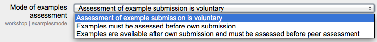

.. _workshop_settings:

Workshop
=========
The workshop module has additional settings which may be changed by an administrator in *Administration > Site administration > Plugins > Activity modules > Workshop*. The settings enable default values to be set for all edit workshop settings.

Grade for submission
^^^^^^^^^^^^^^^^^^^^^
Default maximum grade for submission in workshops.

Grade for assessments
^^^^^^^^^^^^^^^^^^^^^^
Default maximum grade for assessment in workshops.

Decimal places in grades
^^^^^^^^^^^^^^^^^^^^^^^^^
Default number of digits that should be shown after the decimal point when displaying grades.

Maximum submission attachment size
^^^^^^^^^^^^^^^^^^^^^^^^^^^^^^^^^^^
Default maximum submission file size for all workshops on the site (subject to course limits and other local settings)

Grading strategy
^^^^^^^^^^^^^^^^^
Default grading strategy for workshops.

Mode of examples assessment
^^^^^^^^^^^^^^^^^^^^^^^^^^^
Default mode of examples assessment in workshops.

Number of reviews
^^^^^^^^^^^^^^^^^^
Default number of submissions to be randomly allocated

